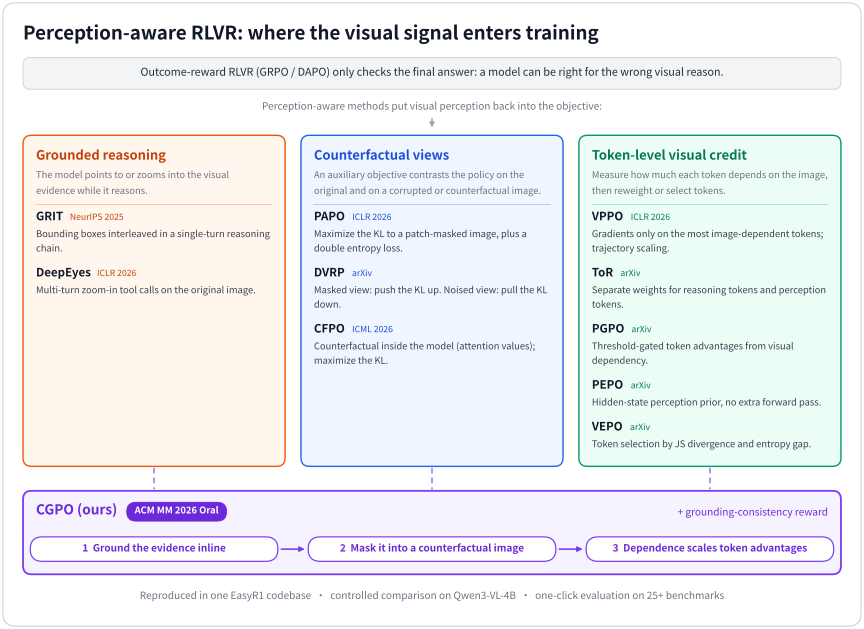

<div align="center">

# Awesome Perception-Aware RLVR

**Unified reproductions, controlled comparison and one-click evaluation for perception-aware reinforcement learning with verifiable rewards (RLVR) in vision-language models, plus a curated paper list.**

PAPO · VPPO · DVRP · ToR · PGPO · PEPO · CFPO · VEPO · NoisyRollout · VGPO · GRIT · DeepEyes · CGPO, and on-policy distillation with VA-OPD · VGS · VCSD · Vision-OPD, in one EasyR1 codebase with 30+ benchmarks

🌟 **Official repository of [CGPO](#-cgpo-acm-mm-2026-oral) (ACM MM 2026 Oral)** 🌟

[English](README.md) | [简体中文](README_zh.md)

[](https://github.com/sindresorhus/awesome)
[](#-paper-list)
[](#-reproduced-methods)
[](https://doi.org/10.1145/3767308.3835969)
[](LICENSE)
[](https://github.com/hiyouga/EasyR1)

</div>

Outcome-reward RL makes vision-language models better reasoners, but the reward only checks the
final answer: a model can be right for the wrong reasons and rely on language priors instead of
the image. **Perception-aware RLVR** methods put visual perception back into the objective, e.g. by
contrasting the policy on counterfactual views of the image, by giving credit to the tokens that
actually depend on the image, or by letting the model ground or zoom into visual evidence while it
reasons. The same ideas reach **on-policy distillation (OPD)**, where a teacher scores the student's
own rollouts token by token: weighting the tokens the image decides, distilling the teacher's visual
gain rather than its language prior, or letting the model teach itself with a privileged view of the
image.

<p align="center">
  
</p>

This repository provides

- the **official implementation of [CGPO](#-cgpo-acm-mm-2026-oral)** (ACM MM 2026 Oral);
- **[Paper list](#-paper-list)**: perception-aware policy optimization, grounded reasoning /
  thinking with images, and the benchmarks used in this line of work;
- **[Reproductions](#-reproduced-methods)** of 16 methods with each paper's own data, model and
  hyper-parameters, plus the baselines they compare against: 12 RLVR methods (PAPO, VPPO, DVRP, ToR,
  PGPO, PEPO, CFPO, VEPO, NoisyRollout, VGPO, GRIT, DeepEyes) and 4 on-policy distillation methods (VA-OPD, VGS, VCSD,
  Vision-OPD);
- **Controlled comparisons** under one setting each: [the RLVR methods](examples/comparison/README.md)
  except DeepEyes on Qwen3-VL-4B, and [on-policy distillation](examples/comparison/opd_qwen3_vl_2b/README.md)
  on a Qwen3-VL-2B student with a Qwen3-VL-8B teacher;
- **[One-click evaluation](eval/README.md)** on the union of the benchmarks used by these papers,
  with per-benchmark download scripts and per-paper suites.

All methods share one training framework (a fork of [EasyR1](https://github.com/hiyouga/EasyR1)),
so they can be combined, compared and extended with a few configuration switches.

> [!NOTE]
> Except for CGPO, the methods are **unofficial re-implementations**. Please refer to and cite the
> original papers and repositories. Differences from the official recipes are documented in each
> method's README. Our numbers come from single-seed runs of these re-implementations and may not
> reproduce the gains reported in the papers; see [About the results](#-about-the-results).

## 📖 Contents

- [News](#-news)
- [Roadmap](#-roadmap)
- [CGPO (ACM MM 2026 Oral)](#-cgpo-acm-mm-2026-oral)
- [Reproduced methods](#-reproduced-methods)
- [Quick start](#-quick-start)
- [Repository layout](#-repository-layout)
- [Controlled comparison](#-controlled-comparison)
- [Evaluation](#-evaluation)
- [Configuration](#-configuration)
- [Paper list](#-paper-list)
- [Contributing](#-contributing)
- [Citation](#-citation)
- [Acknowledgements](#-acknowledgements)

## 🔥 News

- **2026-10**: [VGPO](examples/reproduction/vgpo/README.md): advantages reweighted by last-layer visual focus,
  per token and per prompt group (`algorithm.advantage_scaling_method=vgpo`), with the paper's 3B, 7B and 32B
  settings and a run in the controlled comparison.
- **2026-10**: [NoisyRollout](examples/reproduction/noisyrollout/README.md): GRPO rollouts sampled from
  annealed diffusion-noised images (`algorithm.rollout_image_transform`), with the paper's 7B and 32B
  settings and a run in the controlled comparison.
- **2026-10**: On-policy distillation: a teacher model (a frozen model or an EMA of the policy), OPD
  from sampled tokens and on the full next-token distributions, reproductions of
  [VA-OPD](examples/reproduction/va_opd/README.md), [VGS](examples/reproduction/vgs/README.md),
  [VCSD](examples/reproduction/vcsd/README.md) and [Vision-OPD](examples/reproduction/vision_opd/README.md),
  an [OPD comparison](examples/comparison/opd_qwen3_vl_2b/README.md), and ZoomBench, BLINK, MMStar, AI2D
  and MMMU in the evaluation.
- **2026-10**: 🎉 First release: the official implementation of [CGPO](#-cgpo-acm-mm-2026-oral) (ACM MM
  2026 Oral), 10 reproduced methods, a controlled comparison on Qwen3-VL-4B, and one-click evaluation.
  Reproduction results are being collected with this codebase and will be added to the tables below.

## 🚧 Roadmap

- [ ] Results of the controlled comparison and of the reproductions (runs in progress).
- [x] On-policy distillation (OPD) next to GRPO and DAPO (a teacher model, OPD from sampled tokens and on
  the full distributions), with VA-OPD, VGS, VCSD and Vision-OPD.
- [ ] More single-turn methods in the controlled comparison: NoisyRollout and VGPO (added), then VAPO (next).
- [ ] A grounded-reasoning comparison on data with evidence boxes: TreeVGR, DeFacto and iVGR next to
  GRIT and CGPO.
- [ ] More thinking-with-images methods in the line of DeepEyes: MGPO, Mini-o3 and Pixel Reasoner, and
  MED's evaluation with and without the tool.

Suggestions are welcome: open an issue to propose a method, or see [Contributing](#-contributing).

## 🌟 CGPO (ACM MM 2026 Oral)

This repository is the official code release of

> **CGPO: Counterfactual Grounding Policy Optimization for Evidence-Sensitive Pathology Vision-Language Reasoning**<br>
> Shengxuming Zhang, Linyun Zhou, Hengrui Lou, Zhenyang Wang, Xiuming Zhang, Zunlei Feng<br>
> *Proceedings of the 34th ACM International Conference on Multimedia (MM '26)*, Rio de Janeiro, Brazil, 2026 · **Oral presentation**<br>
> [[Paper]](https://doi.org/10.1145/3767308.3835969) · [[Code and scripts]](examples/reproduction/cgpo/README.md) · [[BibTeX]](#-citation)

CGPO teaches a vision-language model *evidence-sensitive reasoning*: key reasoning steps ground the
visual evidence they rely on, and the conclusion should change when that evidence is removed. The
policy grounds its evidence inline in the chain of thought; masking the grounded regions gives a
counterfactual image, and the shift of the policy's output distribution between the original and
the counterfactual image measures how much each token depends on the evidence. Responses that
depend more on their evidence receive larger advantages on perception-critical tokens, and a
grounding-consistency reward (the policy re-detects every grounded entity) keeps the evidence
boxes from being inflated. Only answer-level supervision is needed.

The paper trains pathology models with the original ms-swift implementation; its in-house
pathology data cannot be released. This repository re-implements CGPO on the shared EasyR1 codebase
and provides the RLVR stage on public natural-image data (ViRL39K) with the paper's backbones
(Qwen2.5-VL-7B, Qwen3-VL-8B) and RL hyper-parameters; CGPO is also part of the
[controlled comparison](examples/comparison/README.md).

```bash
bash scripts/prepare_data.sh cgpo
bash examples/reproduction/cgpo/qwen3_vl_8b_cgpo.sh
bash scripts/eval.sh checkpoints/CGPO-Reproduce/qwen3_vl_8b_cgpo --suite cgpo
```

## 🧪 Reproduced methods

| Method | Paper | Venue | Official code | Scripts | Main setting |
| --- | --- | --- | --- | --- | --- |
| **CGPO** (ours) | [Counterfactual Grounding Policy Optimization for Evidence-Sensitive Pathology Vision-Language Reasoning](https://doi.org/10.1145/3767308.3835969) | ACM MM 2026 (Oral) | this repo | [examples/reproduction/cgpo](examples/reproduction/cgpo) | Qwen2.5-VL-7B / Qwen3-VL-8B, ViRL39K (natural-image reproduction) |
| PAPO | [Perception-Aware Policy Optimization for Multimodal Reasoning](https://arxiv.org/abs/2507.06448) | ICLR 2026 | [GitHub](https://github.com/MikeWangWZHL/PAPO) | [examples/reproduction/papo](examples/reproduction/papo) | Qwen2.5-VL-3B/7B, ViRL39K |
| VPPO | [Spotlight on Token Perception for Multimodal Reinforcement Learning](https://arxiv.org/abs/2510.09285) | ICLR 2026 | [GitHub](https://github.com/huaixuheqing/VPPO-RL) | [examples/reproduction/vppo](examples/reproduction/vppo) | Qwen2.5-VL-7B / Qwen3-VL-8B, ViRL39K |
| DVRP | [Thinking with Deltas: Incentivizing Reinforcement Learning via Differential Visual Reasoning Policy](https://arxiv.org/abs/2601.06801) | arXiv | - | [examples/reproduction/dvrp](examples/reproduction/dvrp) | Qwen2.5-VL-3B/7B, ViRL39K |
| ToR | [Bridging Perception and Reasoning: Token Reweighting for RLVR in Multimodal LLMs](https://arxiv.org/abs/2603.25077) | arXiv | - | [examples/reproduction/tor](examples/reproduction/tor) | Qwen2.5-VL-7B, Geometry3K |
| PGPO | [Not All Tokens See Equally: Perception-Grounded Policy Optimization for Large Vision-Language Models](https://arxiv.org/abs/2604.01840) | arXiv | - | [examples/reproduction/pgpo](examples/reproduction/pgpo) | Qwen2.5-VL-3B/7B, ViRL39K |
| PEPO | [Rethinking Token-Level Policy Optimization for Multimodal Chain-of-Thought](https://arxiv.org/abs/2603.22847) | arXiv | [GitHub](https://github.com/xzxxntxdy/PEPO) | [examples/reproduction/pepo](examples/reproduction/pepo) | Qwen2.5-VL-3B / InternVL3-2B, Geometry3K |
| CFPO | [CFPO: Counterfactual Policy Optimization for Multimodal Reasoning](https://arxiv.org/abs/2606.23206) | ICML 2026 | [GitHub](https://github.com/Raven-July/CFPO) | [examples/reproduction/cfpo](examples/reproduction/cfpo) | Qwen2.5-VL-3B, ViRL39K |
| VEPO | [Entropy Is Not Enough: Unlocking Effective Reinforcement Learning for Visual Reasoning via Vision-Anchored Token Selection](https://arxiv.org/abs/2606.03937) | arXiv | [GitHub](https://github.com/Leonnnnnn929/VEPO) | [examples/reproduction/vepo](examples/reproduction/vepo) | Qwen2.5-VL-7B, Geometry3K |
| NoisyRollout | [NoisyRollout: Reinforcing Visual Reasoning with Data Augmentation](https://arxiv.org/abs/2504.13055) | NeurIPS 2025 | [GitHub](https://github.com/real-absolute-AI/NoisyRollout) | [examples/reproduction/noisyrollout](examples/reproduction/noisyrollout) | Qwen2.5-VL-7B/32B, Geometry3K / K12 |
| VGPO | [Visually-Guided Policy Optimization for Multimodal Reasoning](https://arxiv.org/abs/2604.09349) | ACL 2026 | [GitHub](https://github.com/wzb-bupt/VGPO) | [examples/reproduction/vgpo](examples/reproduction/vgpo) | Qwen2.5-VL-3B/7B/32B, ViRL39K |
| GRIT | [GRIT: Teaching MLLMs to Think with Images](https://arxiv.org/abs/2505.15879) | NeurIPS 2025 | [GitHub](https://github.com/UCSB-AI/GRIT) | [examples/reproduction/grit](examples/reproduction/grit) | Qwen2.5-VL-3B / InternVL3-2B, 20 GRIT samples |
| DeepEyes | [DeepEyes: Incentivizing "Thinking with Images" via Reinforcement Learning](https://arxiv.org/abs/2505.14362) | ICLR 2026 | [GitHub](https://github.com/Visual-Agent/DeepEyes) | [examples/reproduction/deepeyes](examples/reproduction/deepeyes) | Qwen2.5-VL-7B / Qwen3-VL-8B, DeepEyes-47k, multi-turn zoom-in tool |
| VA-OPD | [Visual-Advantage On-Policy Distillation for Vision-Language Models](https://arxiv.org/abs/2605.21924) | arXiv | - | [examples/reproduction/va_opd](examples/reproduction/va_opd) | Qwen3-VL-2B student, 4B / 8B / 32B teachers, Geometry3K / ViRL39K |
| VGS | [Decomposed On-Policy Distillation for Vision-Language Reasoning: Steering Gradients for Visual Grounding](https://arxiv.org/abs/2606.00564) | ICML 2026 (Spotlight) | - | [examples/reproduction/vgs](examples/reproduction/vgs) | Qwen3-VL-2B / 4B students, GRPO-trained Qwen3-VL-8B teacher, Vision-SR1-47K |
| VCSD | [Visual Contrastive Self-Distillation](https://arxiv.org/abs/2607.21556) | arXiv | [GitHub](https://github.com/joliang17/VCSD) | [examples/reproduction/vcsd](examples/reproduction/vcsd) | Qwen3-VL-2B/4B/8B, Qwen3.5-2B/4B/9B, EMA self-teacher, ViRL39K |
| Vision-OPD | [Vision-OPD: Learning to See Fine Details for Multimodal LLMs via On-Policy Self-Distillation](https://arxiv.org/abs/2605.18740) | NeurIPS 2026 | [GitHub](https://github.com/VisionOPD/Vision-OPD) | [examples/reproduction/vision_opd](examples/reproduction/vision_opd) | Qwen3.5-4B / 9B, EMA self-teacher on region crops, Vision-OPD-6K |

Every directory contains a README with the paper's setting, the scripts (method and baselines),
the differences from the official recipe and the reported numbers. The upstream EasyR1 algorithms
(GRPO, DAPO, GSPO, CISPO, SAPO, REINFORCE++, RLOO, ReMax) remain available. The OPD methods learn from a
teacher instead of a verifiable reward; they share a teacher role (`worker.teacher`) and two base
objectives, OPD from sampled tokens (`algorithm.adv_estimator=teacher_log_ratio`) and OPD on the full
next-token distributions (`algorithm.distill_loss_coef`), see
[docs/algorithm_parameters.md](docs/algorithm_parameters.md#on-policy-distillation).

## 🚀 Quick start

**1. Install** (Linux, CUDA 12.8 drivers, conda):

```bash
git clone https://github.com/zsxm1998/awesome-perception-aware-rlvr.git
cd awesome-perception-aware-rlvr
bash scripts/install_env.sh          # creates the conda env "parlvr" (torch 2.10, vLLM 0.19, flash-attn 2.8.3)
conda activate parlvr
QWEN35_FASTPATH_ONLY=1 bash scripts/install_env.sh   # optional, Qwen3.5 models only: adds their fast kernels
```

A [Dockerfile](Dockerfile) based on `vllm/vllm-openai:v0.19.0` is also provided.

**2. Prepare data** (downloaded into `./data`, see [data/README.md](data/README.md)):

```bash
bash scripts/prepare_data.sh papo            # training/validation data of one method
bash scripts/prepare_data.sh all             # or everything
bash scripts/prepare_eval_data.sh papo       # benchmarks of the PAPO evaluation suite
```

If `huggingface.co` is slow or blocked, set `HF_ENDPOINT=https://hf-mirror.com`.

**3. Train**:

```bash
bash examples/reproduction/papo/qwen2_5_vl_7b_grpo_papo.sh                       # PAPO-G, paper setting
bash examples/comparison/qwen3_vl_4b/cgpo.sh                                      # CGPO in the controlled comparison
N_GPUS_PER_NODE=4 bash examples/reproduction/papo/qwen2_5_vl_7b_grpo.sh trainer.total_epochs=1   # any override
```

Checkpoints go to `checkpoints/<project>/<experiment>/global_step_*` (the scripts keep the latest
save and the one with the best validation reward, `trainer.save_limit=1`); logs go to the console and
to `experiment_log.jsonl` in the same folder (`LOGGER='["console","wandb"]'` or `swanlab` for
online tracking).

**4. Evaluate**:

```bash
bash scripts/eval.sh checkpoints/PAPO-Reproduce/qwen2_5_vl_7b_grpo_papo --suite papo
bash scripts/eval.sh Qwen/Qwen2.5-VL-7B-Instruct --suite papo         # base model
```

The wrapper merges FSDP checkpoints into Hugging Face format, runs every benchmark of the suite
with vLLM on all visible GPUs and writes a summary table. See [eval/README.md](eval/README.md).

**5. Free disk space** (after training has finished):

```bash
python3 scripts/finalize_run.py checkpoints/PAPO-Reproduce/qwen2_5_vl_7b_grpo_papo   # --keep best|both, --dry-run
```

A saved step holds the optimizer states and is 3 to 4 times the size of the model (34 GB for a 4B
model). This keeps the last step as Hugging Face weights in `global_step_N/actor` and deletes the
optimizer states and the other steps; the run can no longer be resumed. `--keep best` keeps the step
with the highest validation reward instead and `--keep both` keeps both. The default is the last
step because the validation set is often also an evaluated benchmark, and because it compares
every method after the same number of steps. A single `.../global_step_N` is finalized alone, without
touching the other steps. `scripts/eval.sh` accepts finalized runs.

## 📁 Repository layout

```
.
├── examples/
│   ├── reproduction/<method>/   # paper settings: common.sh (shared args) + one script per run
│   ├── comparison/qwen3_vl_4b/  # controlled comparison: one script per method, identical common.sh
│   ├── comparison/opd_qwen3_vl_2b/  # controlled comparison of on-policy distillation
│   ├── config.yaml              # base training config
│   ├── reward_function/         # reward functions
│   └── format_prompt/, system_prompt/, chat_template/
├── eval/                    # one-click evaluation (registry, loaders, scorers, prepare/)
├── scripts/                 # install_env.sh, prepare_data.sh, prepare_eval_data.sh, eval.sh, finalize_run.py, launcher.sh
├── verl/                    # training framework (EasyR1 fork) with all method implementations
├── docs/                    # algorithm parameters, adding a method, BibTeX, figures (assets/)
├── data/                    # downloaded data (git-ignored)
└── tests/                   # unit tests
```

The perception-aware methods are implemented as composable blocks in `verl/trainer/`:
auxiliary (counterfactual) image views, token-level visual-sensitivity signals, token selection,
advantage scaling, auxiliary losses and extra rewards; on-policy distillation adds a teacher and the
distillation losses (`distillation.py`). See
[docs/algorithm_parameters.md](docs/algorithm_parameters.md) for every switch,
[docs/implementation_notes.md](docs/implementation_notes.md) for behaviors several methods share
(e.g. the gradient of the k3 KL estimator, loss averaging) and
[docs/add_method.md](docs/add_method.md) for adding a new method.

## 📊 Controlled comparison

[`examples/comparison/qwen3_vl_4b`](examples/comparison/README.md) trains every method except DeepEyes
([why](examples/comparison/README.md#why-deepeyes-is-not-included)) on Qwen3-VL-4B-Instruct with
the same data (ViRL39K / MMK12), the same GRPO hyper-parameters and the same evaluation; only the
method-specific arguments differ, and each method keeps the image perturbation of its paper. Results
will be added here.

| Method | GRPO | DAPO | PAPO | VPPO | ToR | DVRP | PGPO | PEPO | CFPO | VEPO | NoisyRollout | VGPO | GRIT | CGPO |
| --- | --- | --- | --- | --- | --- | --- | --- | --- | --- | --- | --- | --- | --- | --- |
| Avg. (comparison suite) | TBD | TBD | TBD | TBD | TBD | TBD | TBD | TBD | TBD | TBD | TBD | TBD | TBD | TBD |

[`examples/comparison/opd_qwen3_vl_2b`](examples/comparison/opd_qwen3_vl_2b/README.md) compares on-policy
distillation on a Qwen3-VL-2B student with Qwen3-VL-8B-Instruct as the teacher, on the same data, budget and
evaluation, with one update per rollout batch and no KL or entropy term. VCSD distills from an EMA of the
student and uses no external teacher; GRPO on the same student is the RL reference.

| Method | GRPO | OPD (sampled tokens) | OPD (full distributions) | VA-OPD | VGS | VCSD |
| --- | --- | --- | --- | --- | --- | --- |
| Avg. (`opd` suite) | TBD | TBD | TBD | TBD | TBD | TBD |

### 📌 About the results

The numbers produced with this repository (the table above, [examples/comparison/README.md](examples/comparison/README.md)
and the "this repo" columns of every `examples/reproduction/<method>` README) come with these caveats:

- **Unofficial re-implementations.** Except for CGPO, every method was re-implemented by us from
  the paper and, where available, the official code. Details that a paper leaves open may be
  implemented differently from the authors' code; the known differences are listed in each
  method's README.
- **Different environment.** Hardware, software versions (PyTorch, vLLM, transformers, the RL
  framework), data preprocessing and the evaluation harness differ from those of the original
  papers, and one evaluation protocol is used for all methods (see [Evaluation](#-evaluation)).
- **Single seed.** Each configuration is trained once. On these benchmarks RLVR results often move
  by a point or more between seeds, which is as large as many reported gains.
- **Shared setting.** The controlled comparison uses one backbone, one dataset and one set of
  hyper-parameters for every method; a method tuned for another setting may not reach its best
  performance here.

If a method does not beat GRPO/DAPO in our tables, or falls short of the gain reported in its
paper, this describes our re-implementation in our setting and is not evidence against the method.
The original papers remain the reference for each method's performance. Authors who notice a
discrepancy are very welcome to open an issue or a pull request, and we will correct the
implementation or the numbers.

## 📈 Evaluation

The evaluation harness covers the union of the benchmarks used by the reproduced papers:
math and multimodal reasoning (Geometry3K, MathVista, We-Math, MMK12, MathVerse, MathVerse-V,
LogicVista, CLEVR counting, MMMU-Pro, MMMU, DynaMath, MathVision), perception and hallucination (POPE,
HallusionBench, MME, MMStar, BLINK, AI2D, TextVQA, CFPO's counterfactual C-VQA-Real and MARS-Bench,
SEED-Bench, ...), grounded reasoning (GRIT's VSR / TallyQA / GQA / OVDEval, refCOCO) and high-resolution
perception (V*, HR-Bench, MME-RealWorld-Lite, ZoomBench). Each benchmark has a download script, and each paper
has a suite (`--suite papo`, `--suite deepeyes`, ...). A checkpoint trained here is prompted as it was trained
(prompt, image size, chat template and tokenizer, read from its run;
[details](eval/README.md#prompts)), whatever the suite. Adding a benchmark takes a loader, a scorer and a
registry entry; see the tutorial in [eval/README.md](eval/README.md#adding-a-new-benchmark).

> [!IMPORTANT]
> The papers use different evaluation protocols (rule-based avg@8 at temperature 1.0 for
> PAPO/VPPO/PGPO/DVRP/CFPO; greedy decoding with an LLM judge for ToR/VEPO/NoisyRollout/GRIT/DeepEyes/Vision-OPD). This
> repository evaluates every model with one harness, so compare methods against baselines run in
> this repository rather than against numbers copied across papers.

## 🔧 Configuration

Environment variables understood by every training script:

| Variable | Default | Meaning |
| --- | --- | --- |
| `MODEL_PATH` | per script | Hugging Face id or local path of the policy |
| `TEACHER_PATH` | per script | teacher of the on-policy distillation scripts |
| `DATA_ROOT` | `./data` | prepared training data |
| `LOGGER` | `["console","file"]` | add `"wandb"`, `"swanlab"`, `"tensorboard"` or `"mlflow"` |
| `N_GPUS_PER_NODE` | per script | GPUs per node |
| `NNODES` | `1` | number of nodes (start a Ray cluster first for multi-node runs) |
| `EXPERIMENT_NAME` | script name | run name; checkpoints in `checkpoints/<project>/<experiment>` |

Any config key can be appended as `key=value` (see [examples/config.yaml](examples/config.yaml)
and [verl/trainer/config.py](verl/trainer/config.py)). Set `USE_MODELSCOPE_HUB=1` to download models
from ModelScope.

**`<think>` in Qwen3-VL Instruct models.** These checkpoints ship `<think>` and `</think>` as added
tokens that were never trained (only the Thinking checkpoints use them). A format prompt that asks
for `<think> ... </think>` is then encoded with two untrained tokens and is not followed: on 256
ViRL39K prompts the format reward of Qwen3-VL-4B-Instruct is 0.00 with the released tokenizer and
0.47 when the tags are plain text, at the same accuracy. By default
(`worker.actor.model.plain_think_tokens=auto`) such tokens are therefore tokenized as plain text:
the tokenizer is loaded as usual (Hugging Face hub, ModelScope or a local path), saved with the two
added tokens removed under `~/.cache/parlvr/tokenizers` (`PARLVR_CACHE_DIR`), and used by training,
rollout and evaluation; checkpoints save this tokenizer. Models whose chat template uses the tokens
(Qwen3-VL Thinking) or that do not have them (Qwen2.5-VL, InternVL) are not changed. Set
`worker.actor.model.plain_think_tokens=false` to keep the released tokenizer (the evaluation reads the
setting from a checkpoint's training record; `--plain-think-tokens false` for other models).

## 📚 Paper list

Verified on 2026-10-01 against arXiv, OpenReview and the official repositories; venues are only listed when confirmed by a primary source (sources: [docs/paper_list_sources.md](docs/paper_list_sources.md), BibTeX: [docs/paper_list.bib](docs/paper_list.bib)). Newest first. Pull requests that add papers are welcome.

### ✅ Reproduced in this repository

Each method below can be trained with the scripts in `examples/reproduction/<method>` (paper setting) and, except DeepEyes and Vision-OPD, `examples/comparison/` (shared setting). Except for CGPO these are unofficial re-implementations; see each README for the differences from the official code.

- **CGPO** (ours) · [CGPO: Counterfactual Grounding Policy Optimization for Evidence-Sensitive Pathology Vision-Language Reasoning](https://doi.org/10.1145/3767308.3835969) · Shengxuming Zhang et al. · ACM MM 2026 (Oral) · official code: this repository<br>
  The policy grounds its evidence inline in the chain of thought; the grounded regions are masked to form a counterfactual image, and the KL between the policy on the original and on the counterfactual image measures how much each token depends on that evidence. Responses that depend more on their evidence get larger advantages on perception-critical tokens, and a grounding-consistency reward (the policy re-detects every grounded entity) keeps the boxes from being inflated. Scripts cover the natural-image setting; the pathology setting of the paper is described in the README. Scripts and setting: [examples/reproduction/cgpo](examples/reproduction/cgpo/README.md).
- **PAPO** · [Perception-Aware Policy Optimization for Multimodal Reasoning](https://arxiv.org/abs/2507.06448) · Zhenhailong Wang et al. · ICLR 2026 · [code](https://github.com/MikeWangWZHL/PAPO)<br>
  Adds an *Implicit Perception Loss* to GRPO/DAPO that maximizes the KL between the policy on the original image and on a randomly patch-masked copy, so the outputs have to depend on the image. A *Double Entropy Loss* on both views keeps the policy from inflating this KL term in degenerate ways. Scripts and setting: [examples/reproduction/papo](examples/reproduction/papo/README.md).
- **VPPO** · [Spotlight on Token Perception for Multimodal Reinforcement Learning](https://arxiv.org/abs/2510.09285) · Siyuan Huang et al. · ICLR 2026 · [code](https://github.com/huaixuheqing/VPPO-RL)<br>
  Measures each token's visual dependency as the KL between predictions with the original and with a perturbed image. Only the 40% most visually dependent tokens of a response receive gradients, and each response's advantage is scaled by its mean visual dependency (built on DAPO). Scripts and setting: [examples/reproduction/vppo](examples/reproduction/vppo/README.md).
- **DVRP** · [Thinking with Deltas: Incentivizing Reinforcement Learning via Differential Visual Reasoning Policy](https://arxiv.org/abs/2601.06801) · Shujian Gao et al. · arXiv<br>
  Builds a visual triplet for every image: the original, a patch-masked view and a diffusion-noised view. It maximizes the KL to the masked view (the answer must need the image), minimizes the KL to the noised view (the answer should be robust to small changes) and adds an entropy penalty on both auxiliary views; on GRPO or DAPO. Scripts and setting: [examples/reproduction/dvrp](examples/reproduction/dvrp/README.md).
- **ToR** · [Bridging Perception and Reasoning: Token Reweighting for RLVR in Multimodal LLMs](https://arxiv.org/abs/2603.25077) · Jinda Lu et al. · arXiv<br>
  Reweights tokens in the GRPO/DAPO objective. The 30% highest-entropy tokens (reasoning tokens) and the 30% tokens whose log-probability changes most when the image is removed (perception tokens) are optimized with separate weights; all other tokens are excluded. Scripts and setting: [examples/reproduction/tor](examples/reproduction/tor/README.md).
- **PGPO** · [Not All Tokens See Equally: Perception-Grounded Policy Optimization for Large Vision-Language Models](https://arxiv.org/abs/2604.01840) · Zekai Ye et al. · arXiv<br>
  A second forward pass with the attention to all visual tokens masked gives each token's visual dependency (KL with vs. without the image). After log compression and per-response normalization, a threshold-gated weight, renormalized to keep the response total, multiplies the DAPO advantage token by token. Scripts and setting: [examples/reproduction/pgpo](examples/reproduction/pgpo/README.md).
- **PEPO** · [Rethinking Token-Level Policy Optimization for Multimodal Chain-of-Thought](https://arxiv.org/abs/2603.22847) · Yunheng Li et al. · arXiv · [code](https://github.com/xzxxntxdy/PEPO)<br>
  Reweights token advantages without an extra forward pass. A perception prior (cosine similarity between a token's hidden state and the vision-token hidden states) is gated by token entropy and turned into softmax token weights, which are mixed into the advantage with a coefficient that grows linearly during training; on GRPO or DAPO. Scripts and setting: [examples/reproduction/pepo](examples/reproduction/pepo/README.md).
- **CFPO** · [CFPO: Counterfactual Policy Optimization for Multimodal Reasoning](https://arxiv.org/abs/2606.23206) · Zhangyuan Yu et al. · ICML 2026 · [code](https://github.com/Raven-July/CFPO)<br>
  Builds the counterfactual inside the model: in every self-attention layer the image-token values that receive the highest text-to-image attention are replaced by the mean image-token value. The policy is pushed away from this counterfactual by maximizing the KL between the factual and the counterfactual outputs; on GRPO or DAPO. Scripts and setting: [examples/reproduction/cfpo](examples/reproduction/cfpo/README.md).
- **VEPO** · [Entropy Is Not Enough: Unlocking Effective Reinforcement Learning for Visual Reasoning via Vision-Anchored Token Selection](https://arxiv.org/abs/2606.03937) · Senjie Jin et al. · arXiv · [code](https://github.com/Leonnnnnn929/VEPO)<br>
  Selects which tokens receive policy gradients. Per token it combines the Jensen-Shannon divergence and the entropy gap between predictions on the original and on a perturbed image with the token entropy, and optimizes only the top 20% of tokens of each response; the sequence-level advantage is unchanged. Scripts and setting: [examples/reproduction/vepo](examples/reproduction/vepo/README.md).
- **NoisyRollout** · [NoisyRollout: Reinforcing Visual Reasoning with Data Augmentation](https://arxiv.org/abs/2504.13055) · Xiangyan Liu et al. · NeurIPS 2025 · [code](https://github.com/real-absolute-AI/NoisyRollout)<br>
  Augments the rollouts instead of the objective: half of each prompt's GRPO rollouts are sampled from a diffusion-noised copy of the image, whose noise strength anneals to almost zero during training, and all rollouts are trained on the clean image in one group. Scripts and setting: [examples/reproduction/noisyrollout](examples/reproduction/noisyrollout/README.md).
- **VGPO** · [Visually-Guided Policy Optimization for Multimodal Reasoning](https://arxiv.org/abs/2604.09349) · Zengbin Wang et al. · ACL 2026 · [code](https://github.com/wzb-bupt/VGPO)<br>
  Reweights advantages by visual focus without an extra forward pass: a token's score is the cosine between its last-layer hidden state and the mean image-token state, the most visual tokens late in a response are boosted to counter fading attention, and the scores scale the advantage token by token within a response and response by response within each prompt's group (on DAPO). Scripts and setting: [examples/reproduction/vgpo](examples/reproduction/vgpo/README.md).
- **GRIT** · [GRIT: Teaching MLLMs to Think with Images](https://arxiv.org/abs/2505.15879) · Yue Fan et al. · NeurIPS 2025 · [code](https://github.com/UCSB-AI/GRIT)<br>
  Trains single-turn grounded reasoning chains that interleave text with bounding boxes, without feeding crops back to the model. GRPO-GR rewards the output structure, producing boxes (with a counting bonus) and answer correctness, with no supervision on the boxes; the paper trains on only 20 image-question-answer triplets. Scripts and setting: [examples/reproduction/grit](examples/reproduction/grit/README.md).
- **DeepEyes** · [DeepEyes: Incentivizing "Thinking with Images" via Reinforcement Learning](https://arxiv.org/abs/2505.14362) · Ziwei Zheng et al. · ICLR 2026 · [code](https://github.com/Visual-Agent/DeepEyes)<br>
  Multi-turn agentic RL with an image zoom-in tool: the model reasons, calls `image_zoom_in_tool` with a bounding box, receives the crop of the original image as a new observation and continues. GRPO optimizes the whole trajectory with an accuracy and format reward plus a tool bonus that is granted only to correct answers that used the tool. Supported here on Qwen2.5-VL (absolute pixel coordinates, as in the paper) and Qwen3-VL (0-1000 coordinates). Scripts and setting: [examples/reproduction/deepeyes](examples/reproduction/deepeyes/README.md).
- **VA-OPD** · [Visual-Advantage On-Policy Distillation for Vision-Language Models](https://arxiv.org/abs/2605.21924) · Ruiqi Liu et al. · arXiv<br>
  On-policy distillation weighted by the teacher's visual advantage: how much log-probability the teacher gives a sampled token with the original image beyond a pixelated copy. Responses are weighted by a softmax of their group-normalized mean advantage and, within a response, the 20% highest-advantage tokens share half of its weight. Scripts and setting: [examples/reproduction/va_opd](examples/reproduction/va_opd/README.md).
- **VGS** · [Decomposed On-Policy Distillation for Vision-Language Reasoning: Steering Gradients for Visual Grounding](https://arxiv.org/abs/2606.00564) · Hee Suk Yoon et al. · ICML 2026 (Spotlight)<br>
  Splits the teacher's distribution into a language prior and a visual gain. Next to the standard reverse KL, the student matches a target that combines its own text-only distribution with the teacher's image-over-text ratio, and a gated term keeps its text-only distribution close to the teacher's on the most vision-dependent tokens. Scripts and setting: [examples/reproduction/vgs](examples/reproduction/vgs/README.md).
- **VCSD** · [Visual Contrastive Self-Distillation](https://arxiv.org/abs/2607.21556) · Yijun Liang et al. · arXiv · [code](https://github.com/joliang17/VCSD)<br>
  Self-distillation without a teacher model, answers or rewards: an EMA of the student scores its rollouts with the original image and with a black image, and the target sharpens the original-image distribution by their contrast on the plausible tokens; the student learns it with a forward KL. Scripts and setting: [examples/reproduction/vcsd](examples/reproduction/vcsd/README.md).
- **Vision-OPD** · [Vision-OPD: Learning to See Fine Details for Multimodal LLMs via On-Policy Self-Distillation](https://arxiv.org/abs/2605.18740) · Qianhao Yuan et al. · NeurIPS 2026 · [code](https://github.com/VisionOPD/Vision-OPD)<br>
  Distills region-level perception into whole-image answering: the student sees the full image with a box around the region, an EMA teacher sees a zoomed crop of it with the same question, and the student matches the teacher on its top-100 tokens with a Jensen-Shannon divergence. Scripts and setting: [examples/reproduction/vision_opd](examples/reproduction/vision_opd/README.md).

### 📑 Other papers

#### 🎯 Perception-aware policy optimization

| Date | Paper | Venue | Code | Key idea |
|---|---|---|---|---|
| 2026-09 | [Reinforcing Multimodal Reasoning via Token-Level Perception-Grounded Advantage Estimation](https://arxiv.org/abs/2609.39168)<br>Zhihan Zhang et al. · `2609.39168` | ACM MM 2026 | [GitHub](https://github.com/Zhihan72/TPAE) | **TPAE**: Scores each token's consistency with vision-dependency/entropy patterns of correct rollouts to modulate sequence-level advantages. |
| 2026-09 | [Anchoring What Matters: A Dual-Level Learning Framework for Visually-Grounded Multimodal Reasoning](https://arxiv.org/abs/2609.18057)<br>Xinxin Song et al. · `2609.18057` | arXiv | - | **PIVOT**: Replays visually-grounded past trajectories as anchors; allocates extra advantage by local visual support and downstream impact. |
| 2026-08 | [Evidence-RL: Towards Evidence-intensive Visual Reasoning](https://arxiv.org/abs/2608.08021)<br>Haojie Huang et al. · `2608.08021` | NeurIPS 2026 | [GitHub](https://github.com/evidencerl/code) | **Evidence-RL (CED)**: Neutralizes object evidence regions vs. matched non-evidence regions; GRPO rewards correct answers that causally rely on evidence. |
| 2026-08 | [ReGround: Restoring Visual Grounding in Multi-Step Reasoning through Self-Diagnosis and Visual Re-Examination](https://arxiv.org/abs/2608.04385)<br>Lei Peng et al. · `2608.04385` | ACM MM 2026 | [GitHub](https://github.com/sespoir/ReGround) | **ReGround**: SFT then GRPO teach self-diagnosis of grounding failures and selective image re-injection during multi-step reasoning. |
| 2026-07 | [SIVA-RL: Sensitivity-Invariance Visual Alignment for Multimodal Reinforcement Learning](https://arxiv.org/abs/2607.13931)<br>Cheng Tang et al. · `2607.13931` | arXiv | [GitHub](https://github.com/tchenglv520/SIVA-RL) | **SIVA-RL**: Within-image PatchSwap interventions; audited reward drop routes each pair to sensitivity or invariance alignment. |
| 2026-06 | [PRPO: Perception-Reinforced Policy Optimization via Token-Level Dynamic Advantage Reshaping](https://arxiv.org/abs/2606.08708)<br>Qiming Li et al. · `2606.08708` | arXiv | - | **PRPO**: Robust Visual Dependency finds grounded, perturbation-stable tokens; Perceptual Advantage Reshaping amplifies their token-level advantages. |
| 2026-06 | [DyCo-RL: Dynamic Cross-Modal Coordination for Visual Reasoning](https://arxiv.org/abs/2606.08035)<br>Hangui Lin et al. · `2606.08035` | arXiv | [GitHub](https://github.com/Sammy20207109/DyCo-RL) | **DyCo-RL**: Assigns tokens visual/text roles via Fisher-Rao attention shifts; reweights advantages by attention-role alignment. |
| 2026-05 | [Attend to Evidence: Evidence-Anchored Spatial Attention Supervision for Multimodal RLVR](https://arxiv.org/abs/2605.30912)<br>Ruina Hu et al. · `2605.30912` | EMNLP 2026 | [GitHub](https://github.com/Nrich-sunny/Attend-to-Evidence) | **EASE**: On high-reward rollouts only, supervises response-to-image attention toward annotated evidence regions (training-time labels). |
| 2026-05 | [Bad Seeing or Bad Thinking? Rewarding Perception for Multimodal Reasoning](https://arxiv.org/abs/2605.14054)<br>Haozhe Wang et al. · `2605.14054` | ICML 2026 | - | **MoCA**: Perception Verification via a blindfolded text reasoner rewards perception separately; credit routed to bad seeing vs. bad thinking. |
| 2026-05 | [Reinforcing Multimodal Reasoning Against Visual Degradation](https://arxiv.org/abs/2605.09262)<br>Rui Liu et al. · `2605.09262` | arXiv | - | **ROMA**: Teacher-forced corrupted views of clean trajectories, worst-case token KL, correctness-conditioned regularization for degradation robustness. |
| 2026-05 | [Structured Role-Aware Policy Optimization for Multimodal Reasoning](https://arxiv.org/abs/2605.07274)<br>Bingqing Jiang et al. · `2605.07274` | arXiv | - | **SRPO**: Role-aware token weights: perception tokens by original-vs-corrupted image dependency, reasoning tokens by consistency with perception. |
| 2026-04 | [Improving Vision-language Models with Perception-centric Process Reward Models](https://arxiv.org/abs/2604.24583)<br>Yingqian Min et al. · `2604.24583` | CVPR 2026 | [GitHub](https://github.com/RUCAIBox/Perceval) | **Perceval**: Perception-centric PRM flags hallucinated image claims; RL applies token-level penalties on those spans instead of sequence-level advantages. |
| 2026-04 | [Faithful GRPO: Improving Visual Spatial Reasoning in Multimodal Language Models via Constrained Policy Optimization](https://arxiv.org/abs/2604.08476)<br>Sai Srinivas Kancheti et al. · `2604.08476` | COLM 2026 | - | **Faithful GRPO**: GRPO with logical-consistency and visual-grounding constraints enforced via Lagrangian dual ascent. |
| 2026-03 | [Seeing with You: Perception-Reasoning Coevolution for Multimodal Reasoning](https://arxiv.org/abs/2603.28618)<br>Ziqi Miao et al. · `2603.28618` | arXiv | [GitHub](https://github.com/Dtc7w3PQ/PRCO) | **PRCO**: One shared policy plays Observer (question-tailored evidence caption, utility reward) and Solver (answer, outcome reward). |
| 2026-02 | [Do MLLMs Really See It: Reinforcing Visual Attention in Multimodal LLMs](https://arxiv.org/abs/2602.08241)<br>Siqu Ou et al. · `2602.08241` | arXiv | - | **SAYO**: RL with a region-level visual-attention reward that aligns optimization with visually grounded reasoning steps. |
| 2026-01 | [CPPO: Contrastive Perception Policy Optimization for VLM Agents](https://arxiv.org/abs/2601.00501)<br>Ahmad Rezaei et al. · `2601.00501` | ICML 2026 Workshop (AIWILD) | [GitHub](https://github.com/vbdi/cppo) | **CPPO**: Contrastive Perception Loss applied to perception tokens detected by entropy shifts under perturbed images. |
| 2025-12 | [Learning When to Look: A Disentangled Curriculum for Strategic Perception in Multimodal Reasoning](https://arxiv.org/abs/2512.17227)<br>Siqi Yang et al. · `2512.17227` | CVPR 2026 Findings | [GitHub](https://github.com/gaozilve-max/learning-when-to-look) | **Learning When to Look**: Disentangled SFT curriculum, then RL with a Pivotal Perception Reward teaching when to look. |
| 2025-12 | [Boosting RL-Based Visual Reasoning with Selective Adversarial Entropy Intervention](https://arxiv.org/abs/2512.10414)<br>Yang Yu et al. · `2512.10414` | arXiv | - | **SaEI**: Entropy-guided adversarial perturbation of visual inputs during RL sampling to enlarge the explored answer space. |
| 2025-09 | [More Thought, Less Accuracy? On the Dual Nature of Reasoning in Vision-Language Models](https://arxiv.org/abs/2509.25848)<br>Xinyu Tian et al. · `2509.25848` | ICLR 2026 | [GitHub](https://github.com/xytian1008/VAPO) | **VAPO**: Counters visual forgetting in long reasoning by explicitly steering the policy toward visually grounded trajectories. |
| 2025-09 | [VTPerception-R1: Enhancing Multimodal Reasoning via Explicit Visual and Textual Perceptual Grounding](https://arxiv.org/abs/2509.24776)<br>Yizhuo Ding et al. · `2509.24776` | arXiv | - | **VTPerception-R1**: Perception-augmented SFT, then RL with visual, textual and consistency perception rewards. |
| 2025-09 | [Perception-Consistency Multimodal Large Language Models Reasoning via Caption-Regularized Policy Optimization](https://arxiv.org/abs/2509.21854)<br>Songjun Tu et al. · `2509.21854` | arXiv | - | **CapPO**: Caption-based consistency regularization between image- and caption-conditioned responses, plus KL-weighted advantage estimation. |
| 2025-09 | [Perception Before Reasoning: Two-Stage Reinforcement Learning for Visual Reasoning in Vision-Language Models](https://arxiv.org/abs/2509.13031)<br>Yan Chen et al. · `2509.13031` | arXiv | [GitHub](https://github.com/cythu/PeBR-R1) | **PeBR-R1**: Two-stage RL: first perception (coarse and fine visual understanding), then reasoning, with dataset-level sampling. |
| 2025-08 | [Self-Rewarding Vision-Language Model via Reasoning Decomposition](https://arxiv.org/abs/2508.19652)<br>Zongxia Li et al. · `2508.19652` | arXiv | [GitHub](https://github.com/zli12321/Vision-SR1) | **Vision-SR1**: Self-reward checks that generated visual descriptions suffice to answer without the image; decoupled visual and answer advantages. |
| 2025-08 | [COPO: Causal-Oriented Policy Optimization for Hallucinations of MLLMs](https://arxiv.org/abs/2508.04182)<br>Peizheng Guo et al. · `2508.04182` | CVPR 2026 | - | **COPO**: Token-level causal-completeness reward (sufficiency/necessity) builds causally informed GRPO advantages to reduce hallucination. |
| 2025-07 | [Look-Back: Implicit Visual Re-focusing in MLLM Reasoning](https://arxiv.org/abs/2507.03019)<br>Shuo Yang et al. · `2507.03019` | arXiv | [GitHub](https://github.com/PKU-YuanGroup/Look-Back) | **Look-Back**: SFT then RL teach MLLMs to autonomously re-focus on visual inputs late in reasoning, without image re-injection. |
| 2025-06 | [ViCrit: A Verifiable Reinforcement Learning Proxy Task for Visual Perception in VLMs](https://arxiv.org/abs/2506.10128)<br>Xiyao Wang et al. · `2506.10128` | NeurIPS 2025 | [GitHub](https://github.com/si0wang/ViCrit) | **ViCrit**: RL proxy task: localize one injected visual hallucination in a human-written caption; exact-match verifiable reward. |
| 2025-06 | [Revisiting Visual Understanding in Multimodal Reasoning through a Lens of Image Perturbation](https://arxiv.org/abs/2506.09736)<br>Yuting Li et al. · `2506.09736` | arXiv | [GitHub](https://github.com/YutingLi0606/Vision-Matters) | **Vision-Matters**: Distractor concatenation, dominance-preserving mixup and random rotation perturbations plugged into SFT, DPO or GRPO. |
| 2025-06 | [Perception-R1: Advancing Multimodal Reasoning Capabilities of MLLMs via Visual Perception Reward](https://arxiv.org/abs/2506.07218)<br>Tong Xiao et al. · `2506.07218` | ICLR 2026 | [GitHub](https://github.com/tongxiao2002/Perception-R1) | **Perception-R1 (Xiao et al.)**: Judging LLM scores consistency between responses and visual annotations as a visual perception reward in RLVR. |
| 2025-05 | [Visionary-R1: Mitigating Shortcuts in Visual Reasoning with Reinforcement Learning](https://arxiv.org/abs/2505.14677)<br>Jiaer Xia et al. · `2505.14677` | TMLR | [GitHub](https://github.com/maifoundations/Visionary-R1) | **Visionary-R1**: Caption-reason-answer output format trained with pure RL to mitigate shortcut learning. |

#### 🔍 Grounded reasoning and thinking with images

| Date | Paper | Venue | Code | Key idea |
|---|---|---|---|---|
| 2026-07 | [Perceive-to-Reason: Decoupling Perception and Reasoning for Fine-Grained Visual Reasoning](https://arxiv.org/abs/2607.01191)<br>Hongxing Li et al. · `2607.01191` | arXiv | [GitHub](https://github.com/ZJU-REAL/Perceive-to-Reason) | **P2R**: Perceiver localizes evidence, Reasoner answers from annotated image and crops; alternating perception/reasoning GRPO. |
| 2026-06 | [Thinking with Visual Grounding](https://arxiv.org/abs/2606.16122)<br>Junkai Zhang et al. · `2606.16122` | arXiv | [GitHub](https://github.com/Jun-Kai-Zhang/visually_grounded_thinking) | **Visually grounded thinking**: Interleaves thoughts with point/box groundings; grounding-aware RL adds dense grounding rewards to answer rewards. |
| 2026-05 | [iVGR: Internalizing Visually Grounded Reasoning for MLLMs with Reinforcement Learning](https://arxiv.org/abs/2605.31096)<br>Chang-Bin Zhang et al. · `2605.31096` | ICML 2026 | [GitHub](https://github.com/Visual-AI/iVGR) | **iVGR**: Dual-stream RL with a consistency reward internalizes localization into textual CoT; no explicit boxes needed at inference. |
| 2026-02 | [What Does Vision Tool-Use Reinforcement Learning Really Learn? Disentangling Tool-Induced and Intrinsic Effects for Crop-and-Zoom](https://arxiv.org/abs/2602.01334)<br>Yan Ma et al. · `2602.01334` | ICML 2026 | [GitHub](https://github.com/GAIR-NLP/Med) | **MED**: Analysis of crop-and-zoom tool-use RL: gains are mostly intrinsic; RL mainly reduces tool-induced harm. |
| 2025-12 | [Deep But Reliable: Advancing Multi-turn Reasoning for Thinking with Images](https://arxiv.org/abs/2512.17306)<br>Wenhao Yang et al. · `2512.17306` | arXiv | - | **DRIM**: Multi-turn tool-based thinking with images; redundancy-penalized policy optimization rewards self-reflection and multi-scale exploration. |
| 2025-12 | [Thinking with Images via Self-Calling Agent](https://arxiv.org/abs/2512.08511)<br>Wenxi Yang et al. · `2512.08511` | arXiv | [GitHub](https://github.com/YWenxi/think-with-images-through-self-calling) | **sCoT**: Recasts interleaved multimodal CoT as language-only CoT that calls parameter-sharing subagents; optimized with GRPO. |
| 2025-12 | [Thinking with Programming Vision: Towards a Unified View for Thinking with Images](https://arxiv.org/abs/2512.03746)<br>Zirun Guo et al. · `2512.03746` | CVPR 2026 | [GitHub](https://github.com/ByteDance-BandAI/CodeVision) | **CodeVision**: Code as a universal tool for image operations; SFT then RL with a dense process reward. |
| 2025-11 | [CropVLM: Learning to Zoom for Fine-Grained Vision-Language Perception](https://arxiv.org/abs/2511.19820)<br>Miguel Carvalho et al. · `2511.19820` | CVPR 2026 Workshop (GRAIL-V) | [GitHub](https://github.com/miguelscarv/cropvlm) | **CropVLM**: RL-trained external cropping model (no box labels) that zooms into relevant regions for any target VLM. |
| 2025-11 | [DeepEyesV2: Toward Agentic Multimodal Model](https://arxiv.org/abs/2511.05271)<br>Jack Hong et al. · `2511.05271` | ICLR 2026 | [GitHub](https://github.com/Visual-Agent/DeepEyesV2) | **DeepEyesV2**: Agentic MLLM invoking code execution and web search; cold-start SFT then RL; introduces RealX-Bench. |
| 2025-09 | [Mixture-of-Visual-Thoughts: Exploring Context-Adaptive Reasoning Mode Selection for General Visual Reasoning](https://arxiv.org/abs/2509.22746)<br>Zejun Li et al. · `2509.22746` | ICLR 2026 | [GitHub](https://github.com/Future-Living-Lab/mixture-of-visual-thoughts) | **MoVT / AdaVaR**: Unifies multiple visual reasoning modes via SFT; AdaGRPO induces context-adaptive mode selection. |
| 2025-09 | [DeFacto: Counterfactual Thinking with Images for Enforcing Evidence-Grounded and Faithful Reasoning](https://arxiv.org/abs/2509.20912)<br>Tianrun Xu et al. · `2509.20912` | ICML 2026 | [GitHub](https://github.com/tinnel123666888/defacto) | **DeFacto**: Positive, counterfactual (evidence masked) and random-masking training with GRPO rewards for evidence-answer consistency. |
| 2025-09 | [Mini-o3: Scaling Up Reasoning Patterns and Interaction Turns for Visual Search](https://arxiv.org/abs/2509.07969)<br>Xin Lai et al. · `2509.07969` | ICLR 2026 | [GitHub](https://github.com/Mini-o3/Mini-o3) | **Mini-o3**: Deep multi-turn visual search: Visual Probe dataset, diverse cold-start trajectories, over-turn masking in RL. |
| 2025-09 | [Reinforced Visual Perception with Tools](https://arxiv.org/abs/2509.01656)<br>Zetong Zhou et al. · `2509.01656` | arXiv | [GitHub](https://github.com/ls-kelvin/REVPT) | **ReVPT**: GRPO-based RL that teaches MLLMs to reason with a suite of four visual perception tools. |
| 2025-08 | [Thyme: Think Beyond Images](https://arxiv.org/abs/2508.11630)<br>Yi-Fan Zhang et al. · `2508.11630` | ICLR 2026 | [GitHub](https://github.com/yfzhang114/Thyme) | **Thyme**: Generates and executes code for image manipulation and computation; SFT then RL with GRPO-ATS. |
| 2025-07 | [Traceable Evidence Enhanced Visual Grounded Reasoning: Evaluation and Methodology](https://arxiv.org/abs/2507.07999)<br>Haochen Wang et al. · `2507.07999` | ICLR 2026 | [GitHub](https://github.com/Haochen-Wang409/TreeVGR) | **TreeVGR**: RL jointly supervising localization and reasoning for traceable evidence; introduces the TreeBench benchmark. |
| 2025-07 | [High-Resolution Visual Reasoning via Multi-Turn Grounding-Based Reinforcement Learning](https://arxiv.org/abs/2507.05920)<br>Xinyu Huang et al. · `2507.05920` | ACL 2026 Findings | [GitHub](https://github.com/EvolvingLMMs-Lab/MGPO) | **MGPO**: Multi-turn RL cropping sub-images at model-predicted grounding coordinates, using only answer-correctness reward. |
| 2025-06 | [Reinforcing Spatial Reasoning in Vision-Language Models with Interwoven Thinking and Visual Drawing](https://arxiv.org/abs/2506.09965)<br>Junfei Wu et al. · `2506.09965` | NeurIPS 2025 | [GitHub](https://github.com/AntResearchNLP/ViLaSR) | **ViLaSR**: Drawing to reason in space (boxes, auxiliary lines); cold start, reflective rejection sampling, then RL. |
| 2025-06 | [Rex-Thinker: Grounded Object Referring via Chain-of-Thought Reasoning](https://arxiv.org/abs/2506.04034)<br>Qing Jiang et al. · `2506.04034` | ICLR 2026 | [GitHub](https://github.com/IDEA-Research/Rex-Thinker) | **Rex-Thinker**: Object referring as CoT over candidate instances; cold-start SFT then GRPO; learns to abstain when nothing matches. |
| 2025-05 | [Grounded Reinforcement Learning for Visual Reasoning](https://arxiv.org/abs/2505.23678)<br>Gabriel Sarch et al. · `2505.23678` | NeurIPS 2025 | [GitHub](https://github.com/Gabesarch/grounded-rl) | **ViGoRL**: RL anchors each reasoning step to image coordinates; multi-turn variant zooms into predicted coordinates. |
| 2025-05 | [ACTIVE-o3: Empowering MLLMs with Active Perception via Pure Reinforcement Learning](https://arxiv.org/abs/2505.21457)<br>Muzhi Zhu et al. · `2505.21457` | ICML 2026 | [GitHub](https://github.com/aim-uofa/Active-o3) | **ACTIVE-o3**: GRPO framework giving MLLMs active perception (region selection) with a dual-form reward, no region supervision. |
| 2025-05 | [Ground-R1: Incentivizing Grounded Visual Reasoning via Reinforcement Learning](https://arxiv.org/abs/2505.20272)<br>Meng Cao et al. · `2505.20272` | arXiv | [GitHub](https://github.com/zzzhhzzz/Ground-R1) | **Ground-R1**: Thinking-with-images trained with Scale Relative Policy Optimization to de-bias reward learning across evidence-region sizes. |
| 2025-05 | [Point-RFT: Improving Multimodal Reasoning with Visually Grounded Reinforcement Finetuning](https://arxiv.org/abs/2505.19702)<br>Minheng Ni et al. · `2505.19702` | NeurIPS 2025 | [GitHub](https://github.com/kodenii/Point-RFT) | **Point-RFT**: Format finetuning on 71K point-grounded rationales, then reinforcement finetuning for visual document understanding. |
| 2025-05 | [VTool-R1: VLMs Learn to Think with Images via Reinforcement Learning on Multimodal Tool Use](https://arxiv.org/abs/2505.19255)<br>Mingyuan Wu et al. · `2505.19255` | ICLR 2026 | [GitHub](https://github.com/VTool-R1/VTool-R1) | **VTool-R1**: RL with Python visual-editing tools yields interleaved text-image CoT using only outcome rewards. |
| 2025-05 | [VLM-R³: Region Recognition, Reasoning, and Refinement for Enhanced Multimodal Chain-of-Thought](https://arxiv.org/abs/2505.16192)<br>Chaoya Jiang et al. · `2505.16192` | NeurIPS 2025 | - | **VLM-R³**: Region-Conditioned RPO rewards choosing regions, crop/zoom transformations, and weaving sub-images into interleaved CoT. |
| 2025-05 | [Pixel Reasoner: Incentivizing Pixel-Space Reasoning with Curiosity-Driven Reinforcement Learning](https://arxiv.org/abs/2505.15966)<br>Haozhe Wang et al. · `2505.15966` | NeurIPS 2025 | [GitHub](https://github.com/TIGER-AI-Lab/Pixel-Reasoner) | **Pixel Reasoner**: Pixel-space operations (zoom-in, select-frame); instruction tuning then curiosity-driven RL. |
| 2025-05 | [Adaptive Chain-of-Focus Reasoning via Dynamic Visual Search and Zooming for Efficient VLMs](https://arxiv.org/abs/2505.15436)<br>Xintong Zhang et al. · `2505.15436` | arXiv | [GitHub](https://github.com/xtong-zhang/Chain-of-Focus) | **Chain-of-Focus**: Adaptive search-and-zoom on key regions; SFT on MM-CoF, then RL with outcome and format rewards. |
| 2025-05 | [Visual Agentic Reinforcement Fine-Tuning](https://arxiv.org/abs/2505.14246)<br>Ziyu Liu et al. · `2505.14246` | arXiv | [GitHub](https://github.com/Liuziyu77/Visual-RFT/tree/main/Visual-ARFT) | **Visual-ARFT**: Agentic RFT for web search and code-based image manipulation (crop, rotate); introduces MAT benchmark. |
| 2025-05 | [UniVG-R1: Reasoning Guided Universal Visual Grounding with Reinforcement Learning](https://arxiv.org/abs/2505.14231)<br>Sule Bai et al. · `2505.14231` | arXiv | [GitHub](https://github.com/AMAP-ML/UniVG-R1) | **UniVG-R1**: Universal visual grounding: CoT cold-start SFT then rule-based RL with difficulty-aware weight adjustment. |
| 2025-05 | [OpenThinkIMG: Learning to Think with Images via Visual Tool Reinforcement Learning](https://arxiv.org/abs/2505.08617)<br>Zhaochen Su et al. · `2505.08617` | arXiv | [GitHub](https://github.com/zhaochen0110/OpenThinkIMG) | **OpenThinkIMG**: Open framework for tool-augmented LVLMs; V-ToolRL learns adaptive vision-tool invocation from task success. |
| 2025-04 | [Perception-R1: Pioneering Perception Policy with Reinforcement Learning](https://arxiv.org/abs/2504.07954)<br>En Yu et al. · `2504.07954` | NeurIPS 2025 | [GitHub](https://github.com/linkangheng/PR1) | **Perception-R1 (Yu et al.)**: Rule-based GRPO for perception policies (grounding, counting, OCR, detection); studies perceptual complexity and reward design. |
| 2025-04 | [VLM-R1: A Stable and Generalizable R1-style Large Vision-Language Model](https://arxiv.org/abs/2504.07615)<br>Haozhan Shen et al. · `2504.07615` | arXiv | [GitHub](https://github.com/om-ai-lab/VLM-R1) | **VLM-R1**: R1-style rule-based RL framework for VLMs on visual understanding tasks; better generalization than SFT. |
| 2025-03 | [Visual-RFT: Visual Reinforcement Fine-Tuning](https://arxiv.org/abs/2503.01785)<br>Ziyu Liu et al. · `2503.01785` | ICCV 2025 | [GitHub](https://github.com/Liuziyu77/Visual-RFT) | **Visual-RFT**: GRPO with verifiable perception rewards (e.g., IoU) for detection, reasoning grounding and fine-grained classification. |

#### 📏 Benchmarks and datasets

| Date | Paper | Venue | Code | Key idea |
|---|---|---|---|---|
| 2025-04 | [VL-Rethinker: Incentivizing Self-Reflection of Vision-Language Models with Reinforcement Learning](https://arxiv.org/abs/2504.08837)<br>Haozhe Wang et al. · `2504.08837` | NeurIPS 2025 | [GitHub](https://github.com/TIGER-AI-Lab/VL-Rethinker) | **VL-Rethinker / ViRL39K**: GRPO with Selective Sample Replay and Forced Rethinking; releases the ViRL39K RL training set. |
| 2025-03 | [MM-Eureka: Exploring the Frontiers of Multimodal Reasoning with Rule-based Reinforcement Learning](https://arxiv.org/abs/2503.07365)<br>Fanqing Meng et al. · `2503.07365` | arXiv | [GitHub](https://github.com/ModalMinds/MM-EUREKA) | **MM-Eureka / MMK12**: Introduces MMK12, a multimodal K12 math dataset with human-verified answers, plus rule-based RL models. |
| 2024-10 | [DynaMath: A Dynamic Visual Benchmark for Evaluating Mathematical Reasoning Robustness of Vision Language Models](https://arxiv.org/abs/2411.00836)<br>Chengke Zou et al. · `2411.00836` | ICLR 2025 | [GitHub](https://github.com/DynaMath/DynaMath) | **DynaMath**: Dynamic visual math benchmark generating question variants to test reasoning robustness. |
| 2024-09 | [MMMU-Pro: A More Robust Multi-discipline Multimodal Understanding Benchmark](https://arxiv.org/abs/2409.02813)<br>Xiang Yue et al. · `2409.02813` | ACL 2025 | [GitHub](https://github.com/MMMU-Benchmark/MMMU/tree/main/mmmu-pro) | **MMMU-Pro**: Harder MMMU: filters text-answerable questions, augments options, adds a vision-only (question-in-image) setting. |
| 2024-08 | [Divide, Conquer and Combine: A Training-Free Framework for High-Resolution Image Perception in Multimodal Large Language Models](https://arxiv.org/abs/2408.15556)<br>Wenbin Wang et al. · `2408.15556` | AAAI 2025 | [GitHub](https://github.com/DreamMr/HR-Bench) | **HR-Bench**: Benchmark of 4K and 8K images for high-resolution perception; also proposes training-free DC². |
| 2024-08 | [MME-RealWorld: Could Your Multimodal LLM Challenge High-Resolution Real-World Scenarios that are Difficult for Humans?](https://arxiv.org/abs/2408.13257)<br>Yi-Fan Zhang et al. · `2408.13257` | ICLR 2025 | [GitHub](https://github.com/MME-Benchmarks/MME-RealWorld) | **MME-RealWorld**: 29,429 human-annotated QA pairs over 43 subtasks on high-resolution real-world images. |
| 2024-07 | [LogicVista: Multimodal LLM Logical Reasoning Benchmark in Visual Contexts](https://arxiv.org/abs/2407.04973)<br>Yijia Xiao et al. · `2407.04973` | arXiv | [GitHub](https://github.com/Yijia-Xiao/LogicVista) | **LogicVista**: 448 multiple-choice questions evaluating logical reasoning in visual contexts across 5 tasks. |
| 2024-07 | [We-Math: Does Your Large Multimodal Model Achieve Human-like Mathematical Reasoning?](https://arxiv.org/abs/2407.01284)<br>Runqi Qiao et al. · `2407.01284` | ACL 2025 | [GitHub](https://github.com/We-Math/We-Math) | **We-Math**: 6.5K visual math problems over 67 knowledge concepts with a four-dimensional diagnostic metric. |
| 2024-03 | [Are We on the Right Way for Evaluating Large Vision-Language Models?](https://arxiv.org/abs/2403.20330)<br>Lin Chen et al. · `2403.20330` | NeurIPS 2024 | [GitHub](https://github.com/MMStar-Benchmark/MMStar) | **MMStar**: 1,500 human-selected vision-indispensable samples minimizing visual-free answering and data leakage. |
| 2024-03 | [MathVerse: Does Your Multi-modal LLM Truly See the Diagrams in Visual Math Problems?](https://arxiv.org/abs/2403.14624)<br>Renrui Zhang et al. · `2403.14624` | ECCV 2024 | [GitHub](https://github.com/ZrrSkywalker/MathVerse) | **MathVerse**: 2,612 diagram math problems, each in six versions varying text vs. diagram information (15K test samples). |
| 2024-02 | [Measuring Multimodal Mathematical Reasoning with MATH-Vision Dataset](https://arxiv.org/abs/2402.14804)<br>Ke Wang et al. · `2402.14804` | NeurIPS 2024 (Datasets and Benchmarks) | [GitHub](https://github.com/mathllm/MATH-V) | **MATH-Vision**: 3,040 competition math problems with visual contexts across 16 disciplines and 5 difficulty levels. |
| 2023-12 | [V\*: Guided Visual Search as a Core Mechanism in Multimodal LLMs](https://arxiv.org/abs/2312.14135)<br>Penghao Wu et al. · `2312.14135` | CVPR 2024 | [GitHub](https://github.com/penghao-wu/vstar) | **V\* / V\*Bench**: Introduces V\*Bench for fine visual detail search in high-resolution images, alongside the SEAL visual-search MLLM. |
| 2023-11 | [MMMU: A Massive Multi-discipline Multimodal Understanding and Reasoning Benchmark for Expert AGI](https://arxiv.org/abs/2311.16502)<br>Xiang Yue et al. · `2311.16502` | CVPR 2024 | [GitHub](https://github.com/MMMU-Benchmark/MMMU) | **MMMU**: 11.5K college-level multimodal questions across 6 disciplines and 30 subjects. |
| 2023-10 | [HallusionBench: An Advanced Diagnostic Suite for Entangled Language Hallucination and Visual Illusion in Large Vision-Language Models](https://arxiv.org/abs/2310.14566)<br>Tianrui Guan et al. · `2310.14566` | CVPR 2024 | [GitHub](https://github.com/tianyi-lab/HallusionBench) | **HallusionBench**: 346 images with 1,129 expert-written questions diagnosing language hallucination and visual illusion. |
| 2023-10 | [MathVista: Evaluating Mathematical Reasoning of Foundation Models in Visual Contexts](https://arxiv.org/abs/2310.02255)<br>Pan Lu et al. · `2310.02255` | ICLR 2024 | [GitHub](https://github.com/lupantech/MathVista) | **MathVista**: 6,141 examples from 28 existing datasets plus three new ones (IQTest, FunctionQA, PaperQA). |
| 2023-05 | [Evaluating Object Hallucination in Large Vision-Language Models](https://arxiv.org/abs/2305.10355)<br>Yifan Li et al. · `2305.10355` | EMNLP 2023 | [GitHub](https://github.com/RUCAIBox/POPE) | **POPE**: Polling-based object probing evaluation for object hallucination in LVLMs. |
| 2021-05 | [Inter-GPS: Interpretable Geometry Problem Solving with Formal Language and Symbolic Reasoning](https://arxiv.org/abs/2105.04165)<br>Pan Lu et al. · `2105.04165` | ACL 2021 | [GitHub](https://github.com/lupantech/InterGPS) | **Inter-GPS / Geometry3K**: Introduces Geometry3K (3,002 geometry problems with formal-language annotations) and the Inter-GPS solver. |

## 🤝 Contributing

Contributions are welcome:

- **Add a paper** to the list: open a pull request that adds a row (newest first) with the arXiv
  link, venue and code link to both READMEs, then run `python scripts/check_docs.py --fix`.
- **Add a method**: follow [docs/add_method.md](docs/add_method.md) and add a
  `examples/reproduction/<method>/` directory with a README and baseline scripts.
- **Add a benchmark**: follow [eval/README.md](eval/README.md#adding-a-new-benchmark).
- **Report reproduction results**: open an issue with the "Reproduction results" form (the command,
  the logs and the evaluation summary).

Before opening a pull request, set up the checks once with `pip install pre-commit && pre-commit install`,
then run `pre-commit run --all-files` and `make test`. The [contributing guide](.github/CONTRIBUTING.md)
([中文](.github/CONTRIBUTING_zh.md)) explains each check, the commit message format and the pull request steps.

## 📝 Citation

If you find this repository useful, please cite CGPO and the papers of the methods you use:

```bibtex
@inproceedings{zhang2026cgpo,
  title     = {{CGPO}: Counterfactual Grounding Policy Optimization for Evidence-Sensitive Pathology Vision-Language Reasoning},
  author    = {Zhang, Shengxuming and Zhou, Linyun and Lou, Hengrui and Wang, Zhenyang and Zhang, Xiuming and Feng, Zunlei},
  booktitle = {Proceedings of the 34th ACM International Conference on Multimedia},
  series    = {MM '26},
  year      = {2026},
  location  = {Rio de Janeiro, Brazil},
  publisher = {ACM},
  address   = {New York, NY, USA},
  numpages  = {10},
  doi       = {10.1145/3767308.3835969},
  url       = {https://doi.org/10.1145/3767308.3835969}
}
```

BibTeX entries of the reproduced methods are in their READMEs and in [docs/references.bib](docs/references.bib).

## 🙏 Acknowledgements

This repository is built on [EasyR1](https://github.com/hiyouga/EasyR1) and
[veRL](https://github.com/volcengine/verl), and uses [vLLM](https://github.com/vllm-project/vllm)
for rollout and evaluation. We thank the authors of all reproduced methods for releasing their
papers, code and data; PAPO, VPPO, GRIT and DeepEyes in particular for their public datasets and
evaluation sets.

## 📄 License

Apache-2.0, see [LICENSE](LICENSE). Datasets and models downloaded by the scripts are subject to
their own licenses.
