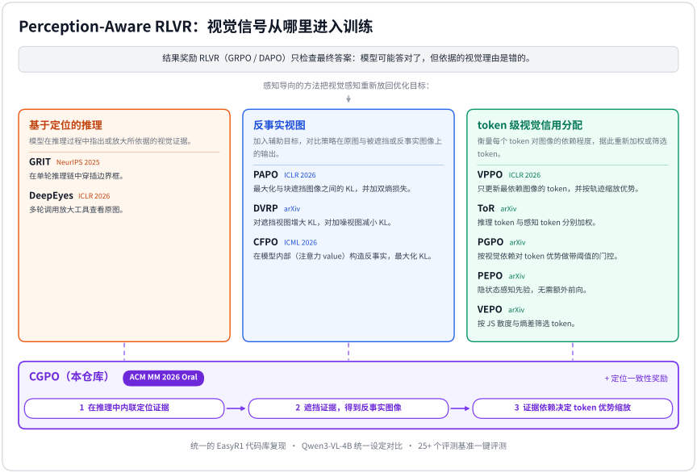

<div align="center">

# Awesome Perception-Aware RLVR

**视觉感知导向的可验证奖励强化学习（Perception-Aware RLVR）：统一复现、公平对比与一键评测，并附论文清单**

PAPO · VPPO · DVRP · ToR · PGPO · PEPO · CFPO · VEPO · GRIT · DeepEyes · CGPO，以及在线策略蒸馏 VA-OPD · VGS · VCSD · Vision-OPD，统一的 EasyR1 代码库，30+ 个评测基准

🌟 **[CGPO](#-cgpo-acm-mm-2026-oral)（ACM MM 2026 Oral）官方代码仓库** 🌟

[English](README.md) | [简体中文](README_zh.md)

[](https://github.com/sindresorhus/awesome)
[](#-论文清单)
[](#-已复现方法)
[](https://doi.org/10.1145/3767308.3835969)
[](LICENSE)
[](https://github.com/hiyouga/EasyR1)

</div>

基于结果奖励的强化学习能提升视觉语言模型的推理能力，但奖励只检查最终答案：模型可能"答对但理由不对"，
依赖语言先验而不是图像本身。**Perception-Aware RLVR** 一类方法把视觉感知重新放回优化目标中，例如
在图像的反事实视图上对比策略输出、把信用分配给真正依赖图像的 token，或者让模型在推理过程中定位、
放大视觉证据。同样的思路也用于**在线策略蒸馏（on-policy distillation, OPD）**：由教师对学生自己采样的
回答逐 token 打分，可以加权那些由图像决定的 token、只蒸馏教师从图像中得到的增益而非其语言先验，或者让模型
在看到更多图像信息的条件下给自己当教师。

<p align="center">
  
</p>

本仓库提供：

- **[CGPO](#-cgpo-acm-mm-2026-oral) 官方实现**（ACM MM 2026 Oral）；
- **[论文清单](#-论文清单)**：感知导向的策略优化、基于定位的推理 / 看图思考（thinking with images），
  以及这一方向常用的评测基准；
- **[方法复现](#-已复现方法)**：14 个方法，各自使用原论文的数据、模型和超参数，并附带论文中对比的基线：
  10 个 RLVR 方法（PAPO、VPPO、DVRP、ToR、PGPO、PEPO、CFPO、VEPO、GRIT、DeepEyes）和 4 个在线策略蒸馏方法
  （VA-OPD、VGS、VCSD、Vision-OPD）；
- **统一设定下的公平对比**：[RLVR 方法](examples/comparison/README.md)（除 DeepEyes 外）在 Qwen3-VL-4B 上对比，
  [在线策略蒸馏](examples/comparison/opd_qwen3_vl_2b/README.md)以 Qwen3-VL-2B 为学生、Qwen3-VL-8B 为教师对比；
- **[一键评测](eval/README.md)**：覆盖这些论文所用评测基准的并集，每个基准都有下载处理脚本，
  每篇论文都有对应的评测套件。

所有方法共用同一个训练框架（[EasyR1](https://github.com/hiyouga/EasyR1) 的分支），
通过少量配置开关即可组合、对比和扩展。

> [!NOTE]
> 除 CGPO 外，其余方法均为**非官方复现**。请参考并引用原论文和原仓库。与官方实现的差异记录在
> 各方法目录的 README 中。我们的数字来自这些复现的单种子运行，未必能复现论文报告的提升，见
> [关于结果的说明](#-关于结果的说明)。

## 📖 目录

- [更新](#-更新)
- [计划](#-计划)
- [CGPO (ACM MM 2026 Oral)](#-cgpo-acm-mm-2026-oral)
- [已复现方法](#-已复现方法)
- [快速开始](#-快速开始)
- [仓库结构](#-仓库结构)
- [统一设定对比](#-统一设定对比)
- [评测](#-评测)
- [配置](#-配置)
- [论文清单](#-论文清单)
- [贡献](#-贡献)
- [引用](#-引用)
- [致谢](#-致谢)

## 🔥 更新

- **2026-10**：在线策略蒸馏：教师模型（冻结模型或策略的 EMA）、基于采样 token 和基于完整下一 token 分布的
  两种 OPD 目标，复现 [VA-OPD](examples/reproduction/va_opd/README.md)、[VGS](examples/reproduction/vgs/README.md)、
  [VCSD](examples/reproduction/vcsd/README.md)、[Vision-OPD](examples/reproduction/vision_opd/README.md)，
  新增 [OPD 统一对比](examples/comparison/opd_qwen3_vl_2b/README.md)，评测新增 ZoomBench、BLINK、MMStar、AI2D、MMMU。
- **2026-10**：🎉 首次发布：[CGPO](#-cgpo-acm-mm-2026-oral)（ACM MM 2026 Oral）官方实现、10 个复现方法、
  Qwen3-VL-4B 上的统一对比、一键评测。复现结果正在用本代码库重新跑，完成后补充到下面的表格中。

## 🚧 计划

- [ ] 统一对比和各方法复现的结果（正在跑）。
- [x] 在线策略蒸馏（OPD）：GRPO、DAPO 之外的基础训练方式（教师模型，基于采样 token 和基于完整分布的两种目标），
  及 VA-OPD、VGS、VCSD、Vision-OPD。
- [ ] 更多 DeepEyes 方向的"用图像思考"方法，如 MGPO、Chain-of-Focus、Pixel Reasoner。
- [ ] 更多 GRIT 方向的定位推理方法，如 TreeVGR、DeFacto、ViGoRL。

欢迎提建议：可以开 issue 提议要加入的方法，或参见[贡献](#-贡献)。

## 🌟 CGPO (ACM MM 2026 Oral)

本仓库是以下论文的官方代码：

> **CGPO: Counterfactual Grounding Policy Optimization for Evidence-Sensitive Pathology Vision-Language Reasoning**<br>
> Shengxuming Zhang, Linyun Zhou, Hengrui Lou, Zhenyang Wang, Xiuming Zhang, Zunlei Feng<br>
> *Proceedings of the 34th ACM International Conference on Multimedia (MM '26)*, Rio de Janeiro, Brazil, 2026 · **Oral 报告**<br>
> [[论文]](https://doi.org/10.1145/3767308.3835969) · [[代码与脚本]](examples/reproduction/cgpo/README.md) · [[BibTeX]](#-引用)

CGPO 训练视觉语言模型进行*证据敏感推理*：关键推理步骤要定位它所依据的视觉证据，并且去掉这些证据后结论应当改变。
策略在思维链中以内联方式定位证据；把定位到的区域遮挡得到反事实图像，用策略在原图与反事实图像上输出分布的
变化衡量每个 token 对证据的依赖程度。证据依赖越强的回答，其感知关键 token 的优势被放大；定位一致性奖励
（由策略对每个定位实体重新检测）防止证据框被刻意放大。整个方法只需要答案级监督。

论文用最初的 ms-swift 实现在病理数据上训练，其中的院内病理数据无法公开。本仓库在统一的 EasyR1 代码库上
重新实现了 CGPO，在公开的自然图像数据（ViRL39K）上复现其强化学习阶段，使用论文的模型（Qwen2.5-VL-7B、
Qwen3-VL-8B）和强化学习超参数；CGPO 也参与了[统一设定对比](examples/comparison/README.md)。

```bash
bash scripts/prepare_data.sh cgpo
bash examples/reproduction/cgpo/qwen3_vl_8b_cgpo.sh
bash scripts/eval.sh checkpoints/CGPO-Reproduce/qwen3_vl_8b_cgpo --suite cgpo
```

## 🧪 已复现方法

| 方法 | 论文 | 会议 | 官方代码 | 脚本 | 主要设定 |
| --- | --- | --- | --- | --- | --- |
| **CGPO**（本仓库） | [Counterfactual Grounding Policy Optimization for Evidence-Sensitive Pathology Vision-Language Reasoning](https://doi.org/10.1145/3767308.3835969) | ACM MM 2026 (Oral) | 本仓库 | [examples/reproduction/cgpo](examples/reproduction/cgpo) | Qwen2.5-VL-7B / Qwen3-VL-8B，ViRL39K（自然图像复现） |
| PAPO | [Perception-Aware Policy Optimization for Multimodal Reasoning](https://arxiv.org/abs/2507.06448) | ICLR 2026 | [GitHub](https://github.com/MikeWangWZHL/PAPO) | [examples/reproduction/papo](examples/reproduction/papo) | Qwen2.5-VL-3B/7B，ViRL39K |
| VPPO | [Spotlight on Token Perception for Multimodal Reinforcement Learning](https://arxiv.org/abs/2510.09285) | ICLR 2026 | [GitHub](https://github.com/huaixuheqing/VPPO-RL) | [examples/reproduction/vppo](examples/reproduction/vppo) | Qwen2.5-VL-7B / Qwen3-VL-8B，ViRL39K |
| DVRP | [Thinking with Deltas: Incentivizing Reinforcement Learning via Differential Visual Reasoning Policy](https://arxiv.org/abs/2601.06801) | arXiv | - | [examples/reproduction/dvrp](examples/reproduction/dvrp) | Qwen2.5-VL-3B/7B，ViRL39K |
| ToR | [Bridging Perception and Reasoning: Token Reweighting for RLVR in Multimodal LLMs](https://arxiv.org/abs/2603.25077) | arXiv | - | [examples/reproduction/tor](examples/reproduction/tor) | Qwen2.5-VL-7B，Geometry3K |
| PGPO | [Not All Tokens See Equally: Perception-Grounded Policy Optimization for Large Vision-Language Models](https://arxiv.org/abs/2604.01840) | arXiv | - | [examples/reproduction/pgpo](examples/reproduction/pgpo) | Qwen2.5-VL-3B/7B，ViRL39K |
| PEPO | [Rethinking Token-Level Policy Optimization for Multimodal Chain-of-Thought](https://arxiv.org/abs/2603.22847) | arXiv | [GitHub](https://github.com/xzxxntxdy/PEPO) | [examples/reproduction/pepo](examples/reproduction/pepo) | Qwen2.5-VL-3B / InternVL3-2B，Geometry3K |
| CFPO | [CFPO: Counterfactual Policy Optimization for Multimodal Reasoning](https://arxiv.org/abs/2606.23206) | ICML 2026 | [GitHub](https://github.com/Raven-July/CFPO) | [examples/reproduction/cfpo](examples/reproduction/cfpo) | Qwen2.5-VL-3B，ViRL39K |
| VEPO | [Entropy Is Not Enough: Unlocking Effective Reinforcement Learning for Visual Reasoning via Vision-Anchored Token Selection](https://arxiv.org/abs/2606.03937) | arXiv | [GitHub](https://github.com/Leonnnnnn929/VEPO) | [examples/reproduction/vepo](examples/reproduction/vepo) | Qwen2.5-VL-7B，Geometry3K |
| GRIT | [GRIT: Teaching MLLMs to Think with Images](https://arxiv.org/abs/2505.15879) | NeurIPS 2025 | [GitHub](https://github.com/UCSB-AI/GRIT) | [examples/reproduction/grit](examples/reproduction/grit) | Qwen2.5-VL-3B / InternVL3-2B，GRIT 的 20 条样本 |
| DeepEyes | [DeepEyes: Incentivizing "Thinking with Images" via Reinforcement Learning](https://arxiv.org/abs/2505.14362) | ICLR 2026 | [GitHub](https://github.com/Visual-Agent/DeepEyes) | [examples/reproduction/deepeyes](examples/reproduction/deepeyes) | Qwen2.5-VL-7B / Qwen3-VL-8B，DeepEyes-47k，多轮放大工具 |
| VA-OPD | [Visual-Advantage On-Policy Distillation for Vision-Language Models](https://arxiv.org/abs/2605.21924) | arXiv | - | [examples/reproduction/va_opd](examples/reproduction/va_opd) | Qwen3-VL-2B 学生，4B / 8B / 32B 教师，Geometry3K / ViRL39K |
| VGS | [Decomposed On-Policy Distillation for Vision-Language Reasoning: Steering Gradients for Visual Grounding](https://arxiv.org/abs/2606.00564) | ICML 2026 (Spotlight) | - | [examples/reproduction/vgs](examples/reproduction/vgs) | Qwen3-VL-2B / 4B 学生，经 GRPO 训练的 Qwen3-VL-8B 教师，Vision-SR1-47K |
| VCSD | [Visual Contrastive Self-Distillation](https://arxiv.org/abs/2607.21556) | arXiv | [GitHub](https://github.com/joliang17/VCSD) | [examples/reproduction/vcsd](examples/reproduction/vcsd) | Qwen3-VL-2B/4B/8B、Qwen3.5-2B/4B/9B，EMA 自教师，ViRL39K |
| Vision-OPD | [Vision-OPD: Learning to See Fine Details for Multimodal LLMs via On-Policy Self-Distillation](https://arxiv.org/abs/2605.18740) | NeurIPS 2026 | [GitHub](https://github.com/VisionOPD/Vision-OPD) | [examples/reproduction/vision_opd](examples/reproduction/vision_opd) | Qwen3.5-4B / 9B，以区域裁剪图为输入的 EMA 自教师，Vision-OPD-6K |

每个方法目录都有 README，说明论文设定、脚本（方法与基线）、与官方实现的差异以及论文报告的结果。
EasyR1 原有的算法（GRPO、DAPO、GSPO、CISPO、SAPO、REINFORCE++、RLOO、ReMax）仍然可用。OPD 方法从教师
学习，不使用可验证奖励；它们共用教师（`worker.teacher`）和两种基础目标：基于采样 token 的 OPD
（`algorithm.adv_estimator=teacher_log_ratio`）和基于完整下一 token 分布的 OPD（`algorithm.distill_loss_coef`），见
[docs/algorithm_parameters.md](docs/algorithm_parameters.md#on-policy-distillation)。

## 🚀 快速开始

**1. 安装环境**（Linux、CUDA 12.8 驱动、conda）：

```bash
git clone https://github.com/zsxm1998/awesome-perception-aware-rlvr.git
cd awesome-perception-aware-rlvr
bash scripts/install_env.sh          # 创建 conda 环境 "parlvr"（torch 2.10、vLLM 0.19、flash-attn 2.8.3）
conda activate parlvr
QWEN35_FASTPATH_ONLY=1 bash scripts/install_env.sh   # 可选，仅 Qwen3.5 模型需要：补装其加速算子
```

也提供了基于 `vllm/vllm-openai:v0.19.0` 的 [Dockerfile](Dockerfile)。

**2. 准备数据**（下载到 `./data`，见 [data/README.md](data/README.md)）：

```bash
bash scripts/prepare_data.sh papo            # 某个方法的训练 / 验证数据
bash scripts/prepare_data.sh all             # 或全部数据
bash scripts/prepare_eval_data.sh papo       # PAPO 评测套件中的基准
```

如果访问 `huggingface.co` 较慢或受限，可设置 `HF_ENDPOINT=https://hf-mirror.com`。

**3. 训练**：

```bash
bash examples/reproduction/papo/qwen2_5_vl_7b_grpo_papo.sh                       # PAPO-G，论文设定
bash examples/comparison/qwen3_vl_4b/cgpo.sh                                      # 统一对比中的 CGPO
N_GPUS_PER_NODE=4 bash examples/reproduction/papo/qwen2_5_vl_7b_grpo.sh trainer.total_epochs=1   # 任意覆盖参数
```

checkpoint 保存在 `checkpoints/<project>/<experiment>/global_step_*`（脚本只保留最新一次保存和验证奖励
最高的一次，`trainer.save_limit=1`）；日志输出到终端，同时写入同一目录下的 `experiment_log.jsonl`
（在线记录可设置 `LOGGER='["console","wandb"]'` 或 `swanlab`）。

**4. 评测**：

```bash
bash scripts/eval.sh checkpoints/PAPO-Reproduce/qwen2_5_vl_7b_grpo_papo --suite papo
bash scripts/eval.sh Qwen/Qwen2.5-VL-7B-Instruct --suite papo         # 基座模型
```

评测脚本会自动把 FSDP checkpoint 合并成 Hugging Face 格式，在所有可见 GPU 上用 vLLM 跑完套件中的
每个基准，并输出汇总表。详见 [eval/README.md](eval/README.md)。

**5. 释放磁盘空间**（训练结束后）：

```bash
python3 scripts/finalize_run.py checkpoints/PAPO-Reproduce/qwen2_5_vl_7b_grpo_papo   # --keep best|both，--dry-run
```

每个保存的 step 都带优化器状态，大小是模型本身的 3 到 4 倍（4B 模型为 34 GB）。该脚本把最后一步保留为
`global_step_N/actor` 中的 Hugging Face 权重，删除优化器状态和其余 step，此后该实验无法再续训。
`--keep best` 改为保留验证奖励最高的一步，`--keep both` 两者都保留。默认保留最后一步，因为验证集往往
同时也是评测基准，而且这样所有方法都在相同训练步数下比较。传入单个 `.../global_step_N` 时只处理这一步，
不动其他 step。`scripts/eval.sh` 可以直接评测收尾后的实验。

## 📁 仓库结构

```
.
├── examples/
│   ├── reproduction/<method>/   # 各论文原设定：common.sh（公共参数）+ 每个实验一个脚本
│   ├── comparison/qwen3_vl_4b/  # 统一设定对比：每个方法一个脚本，共用 common.sh
│   ├── comparison/opd_qwen3_vl_2b/  # 在线策略蒸馏的统一设定对比
│   ├── config.yaml              # 基础训练配置
│   ├── reward_function/         # 奖励函数
│   └── format_prompt/、system_prompt/、chat_template/
├── eval/                    # 一键评测（注册表、loader、scorer、prepare/）
├── scripts/                 # install_env.sh、prepare_data.sh、prepare_eval_data.sh、eval.sh、finalize_run.py、launcher.sh
├── verl/                    # 训练框架（EasyR1 分支），包含所有方法的实现
├── docs/                    # 算法参数说明、新增方法教程、BibTeX、插图（assets/）
├── data/                    # 下载的数据（不纳入 git）
└── tests/                   # 单元测试
```

各方法在 `verl/trainer/` 中被实现为可组合的模块：辅助（反事实）图像视图、token 级视觉敏感度信号、
token 选择、优势缩放、辅助损失和额外奖励；在线策略蒸馏另有教师和蒸馏损失（`distillation.py`）。所有开关见
[docs/algorithm_parameters.md](docs/algorithm_parameters.md)，多个方法共有的实现细节（如 k3 KL 估计的梯度方向、损失平均方式）见
[docs/implementation_notes.md](docs/implementation_notes.md)，新增方法见
[docs/add_method.md](docs/add_method.md)。

## 📊 统一设定对比

[`examples/comparison/qwen3_vl_4b`](examples/comparison/README.md) 在 Qwen3-VL-4B-Instruct 上训练除 DeepEyes 外的所有方法
（[原因](examples/comparison/README.md#why-deepeyes-is-not-included)），使用相同的数据（ViRL39K / MMK12）、相同的
GRPO 超参数和相同的评测，只有方法相关的参数不同，各方法沿用其论文中的图像扰动方式。结果将补充到这里。

| 方法 | GRPO | DAPO | PAPO | VPPO | ToR | DVRP | PGPO | PEPO | CFPO | VEPO | GRIT | CGPO |
| --- | --- | --- | --- | --- | --- | --- | --- | --- | --- | --- | --- | --- |
| 平均（comparison 套件） | TBD | TBD | TBD | TBD | TBD | TBD | TBD | TBD | TBD | TBD | TBD | TBD |

[`examples/comparison/opd_qwen3_vl_2b`](examples/comparison/opd_qwen3_vl_2b/README.md) 以 Qwen3-VL-2B 为学生、
Qwen3-VL-8B-Instruct 为教师对比在线策略蒸馏，使用相同的数据、训练量和评测，每批采样只更新一次，不加 KL 和熵项。
VCSD 从学生自身的 EMA 蒸馏，不使用外部教师；同一学生上的 GRPO 作为强化学习参照。

| 方法 | GRPO | OPD（采样 token） | OPD（完整分布） | VA-OPD | VGS | VCSD |
| --- | --- | --- | --- | --- | --- | --- |
| 平均（`opd` 套件） | TBD | TBD | TBD | TBD | TBD | TBD |

### 📌 关于结果的说明

用本仓库得到的数字（上表、[examples/comparison/README.md](examples/comparison/README.md) 以及各 `examples/reproduction/<method>`
README 中标注为本仓库的列）请结合以下几点阅读：

- **非官方复现。** 除 CGPO 外，所有方法都由我们依据论文（以及已公开的官方代码）重新实现。论文未写明
  的细节可能与作者代码不同，已知差异列在各方法的 README 中。
- **环境不同。** 硬件、软件版本（PyTorch、vLLM、transformers、强化学习框架）、数据预处理和评测框架
  都与原论文不同，并且所有方法使用同一套评测协议（见[评测](#-评测)）。
- **单种子。** 每个配置只训练一次。在这些基准上，强化学习结果在不同种子之间常有一个点以上的波动，
  与许多论文报告的提升幅度相当。
- **统一设定。** 统一对比对所有方法使用同一个模型、同一份数据和同一组超参数；针对其他设定调优的方法
  在这里未必能发挥最佳性能。

因此，如果某个方法在我们的表中没有超过 GRPO/DAPO，或没有达到论文报告的提升，这只说明我们的复现在
我们的设定下的结果，不能作为否定该方法的证据。各方法的性能请以原论文为准。如果原作者发现差异，
非常欢迎提交 issue 或 PR，我们会修正实现或数字。

## 📈 评测

评测系统覆盖所复现论文使用的基准的并集：数学与多模态推理（Geometry3K、MathVista、We-Math、MMK12、
MathVerse、MathVerse-V、LogicVista、CLEVR 计数、MMMU-Pro、MMMU、DynaMath、MathVision），感知与幻觉
（POPE、HallusionBench、MME、MMStar、BLINK、AI2D、TextVQA、CFPO 的反事实基准 C-VQA-Real 与 MARS-Bench、
SEED-Bench 等），基于定位的推理（GRIT 的 VSR / TallyQA / GQA / OVDEval、refCOCO），以及高分辨率感知
（V*、HR-Bench、MME-RealWorld-Lite、ZoomBench）。每个基准都有下载脚本，每篇论文都有评测套件（`--suite papo`、
`--suite deepeyes` 等）。无论用哪个套件，本仓库训练的检查点都按训练时的方式提问（提示词、图像尺寸、对话模板与
分词器，从其训练目录读取，[详见](eval/README.md#prompts)）。新增基准只需要 loader、scorer 和注册表条目，教程见
[eval/README.md](eval/README.md#adding-a-new-benchmark)。

> [!IMPORTANT]
> 各论文的评测协议并不相同（PAPO/VPPO/PGPO/DVRP/CFPO 使用温度 1.0 下基于规则的 avg@8；
> ToR/VEPO/GRIT/DeepEyes/Vision-OPD 使用贪心解码加 LLM 裁判）。本仓库用同一套评测系统评测所有模型，
> 因此请与本仓库中跑出的基线比较，而不要直接与跨论文摘抄的数字比较。

## 🔧 配置

所有训练脚本都支持以下环境变量：

| 变量 | 默认值 | 含义 |
| --- | --- | --- |
| `MODEL_PATH` | 由脚本指定 | 策略模型的 Hugging Face id 或本地路径 |
| `TEACHER_PATH` | 由脚本指定 | 在线策略蒸馏脚本的教师模型 |
| `DATA_ROOT` | `./data` | 训练数据目录 |
| `LOGGER` | `["console","file"]` | 可加入 `"wandb"`、`"swanlab"`、`"tensorboard"`、`"mlflow"` |
| `N_GPUS_PER_NODE` | 由脚本指定 | 每个节点的 GPU 数 |
| `NNODES` | `1` | 节点数（多机训练需先启动 Ray 集群） |
| `EXPERIMENT_NAME` | 脚本名 | 实验名；checkpoint 保存在 `checkpoints/<project>/<experiment>` |

任何配置项都可以用 `key=value` 追加在命令后面（见 [examples/config.yaml](examples/config.yaml) 和
[verl/trainer/config.py](verl/trainer/config.py)）。设置 `USE_MODELSCOPE_HUB=1` 可从 ModelScope 下载模型。

**Qwen3-VL Instruct 模型中的 `<think>`。** 这些模型的分词器带有 `<think>`、`</think>` 两个附加 token，
但它们从未被训练（只有 Thinking 版会用到）。格式提示词要求写 `<think> ... </think>` 时，这两个标签会被编码成
未训练的 token，模型不会照做：在 256 道 ViRL39K 题上，Qwen3-VL-4B-Instruct 用原版分词器的格式奖励为 0.00，
把标签当普通文字时为 0.47，准确率相同。因此默认（`worker.actor.model.plain_think_tokens=auto`）把这类
token 当普通文字处理：分词器照常加载（Hugging Face、ModelScope 或本地路径均可），删掉这两个附加 token 后
保存在 `~/.cache/parlvr/tokenizers`（可用 `PARLVR_CACHE_DIR` 修改），训练、rollout 和评测都使用它，检查点
也保存这份分词器。对话模板会用到这两个 token 的模型（Qwen3-VL Thinking）或本来没有它们的模型（Qwen2.5-VL、
InternVL）不受影响。设置 `worker.actor.model.plain_think_tokens=false`
可保留原版分词器（评测从检查点的训练记录读取该设置；其他模型用 `--plain-think-tokens false`）。

## 📚 论文清单

以下条目于 2026-10-01 逐条对照 arXiv、OpenReview 和官方仓库核实；只有在一手来源确认时才标注会议（来源见 [docs/paper_list_sources.md](docs/paper_list_sources.md)，BibTeX 见 [docs/paper_list.bib](docs/paper_list.bib)）。按时间倒序排列，欢迎提交 PR 补充论文。

### ✅ 本仓库已复现的论文

下列方法都可以用 `examples/reproduction/<method>`（论文原设定）中的脚本训练，除 DeepEyes 和 Vision-OPD 外也都可以用 `examples/comparison/`（统一设定）中的脚本训练。除 CGPO 外均为非官方复现，与官方代码的差异见各方法的 README。

- **CGPO**（本仓库） · [CGPO: Counterfactual Grounding Policy Optimization for Evidence-Sensitive Pathology Vision-Language Reasoning](https://doi.org/10.1145/3767308.3835969) · Shengxuming Zhang et al. · ACM MM 2026 (Oral) · 官方代码：本仓库<br>
  策略在思维链中以内联方式定位证据；将定位到的区域遮挡得到反事实图像，用策略在原图与反事实图像上输出分布的 KL 衡量每个 token 对证据的依赖程度。证据依赖越强的回答，其感知关键 token 的优势被放大；定位一致性奖励（由策略对每个定位实体重新检测）防止框被刻意放大。脚本覆盖自然图像设定，论文中的病理设定在 README 中以文字说明。脚本与设定：[examples/reproduction/cgpo](examples/reproduction/cgpo/README.md)。
- **PAPO** · [Perception-Aware Policy Optimization for Multimodal Reasoning](https://arxiv.org/abs/2507.06448) · Zhenhailong Wang et al. · ICLR 2026 · [代码](https://github.com/MikeWangWZHL/PAPO)<br>
  在 GRPO/DAPO 上加入*隐式感知损失*：最大化策略在原图与随机块遮挡图像上输出分布的 KL，迫使输出依赖图像；再在两个视图上加入*双熵损失*，防止策略以退化方式抬高这一 KL 项。脚本与设定：[examples/reproduction/papo](examples/reproduction/papo/README.md)。
- **VPPO** · [Spotlight on Token Perception for Multimodal Reinforcement Learning](https://arxiv.org/abs/2510.09285) · Siyuan Huang et al. · ICLR 2026 · [代码](https://github.com/huaixuheqing/VPPO-RL)<br>
  以原图与扰动图像下预测分布的 KL 衡量每个 token 的视觉依赖。每个回答只有视觉依赖最高的 40% token 接收梯度，并按回答的平均视觉依赖缩放其优势（基于 DAPO）。脚本与设定：[examples/reproduction/vppo](examples/reproduction/vppo/README.md)。
- **DVRP** · [Thinking with Deltas: Incentivizing Reinforcement Learning via Differential Visual Reasoning Policy](https://arxiv.org/abs/2601.06801) · Shujian Gao et al. · arXiv<br>
  为每张图像构造视觉三元组：原图、块遮挡视图和扩散加噪视图。最大化与遮挡视图的 KL（答案必须依赖图像），最小化与加噪视图的 KL（答案应对小扰动保持稳定），并对两个辅助视图加熵惩罚；可基于 GRPO 或 DAPO。脚本与设定：[examples/reproduction/dvrp](examples/reproduction/dvrp/README.md)。
- **ToR** · [Bridging Perception and Reasoning: Token Reweighting for RLVR in Multimodal LLMs](https://arxiv.org/abs/2603.25077) · Jinda Lu et al. · arXiv<br>
  在 GRPO/DAPO 目标中对 token 重新加权：熵最高的 30% token（推理 token）与去掉图像后对数概率变化最大的 30% token（感知 token）分别以不同权重优化，其余 token 不参与优化。脚本与设定：[examples/reproduction/tor](examples/reproduction/tor/README.md)。
- **PGPO** · [Not All Tokens See Equally: Perception-Grounded Policy Optimization for Large Vision-Language Models](https://arxiv.org/abs/2604.01840) · Zekai Ye et al. · arXiv<br>
  额外做一次屏蔽全部视觉 token 注意力的前向，得到每个 token 的视觉依赖（有图与无图的 KL）。经对数压缩和回答内归一化后，通过带阈值的门控权重（重新归一化以保持回答总权重）逐 token 乘到 DAPO 优势上。脚本与设定：[examples/reproduction/pgpo](examples/reproduction/pgpo/README.md)。
- **PEPO** · [Rethinking Token-Level Policy Optimization for Multimodal Chain-of-Thought](https://arxiv.org/abs/2603.22847) · Yunheng Li et al. · arXiv · [代码](https://github.com/xzxxntxdy/PEPO)<br>
  无需额外前向即可重新加权 token 优势：以 token 隐状态与视觉 token 隐状态的余弦相似度作为感知先验，经 token 熵门控后通过 softmax 得到 token 权重，并以随训练线性增长的系数混入优势；可基于 GRPO 或 DAPO。脚本与设定：[examples/reproduction/pepo](examples/reproduction/pepo/README.md)。
- **CFPO** · [CFPO: Counterfactual Policy Optimization for Multimodal Reasoning](https://arxiv.org/abs/2606.23206) · Zhangyuan Yu et al. · ICML 2026 · [代码](https://github.com/Raven-July/CFPO)<br>
  在模型内部构造反事实：在每个自注意力层中，将文本到图像注意力最高的图像 token 的 value 替换为图像 token value 的均值，并通过最大化事实与反事实输出之间的 KL 使策略远离该反事实；可基于 GRPO 或 DAPO。脚本与设定：[examples/reproduction/cfpo](examples/reproduction/cfpo/README.md)。
- **VEPO** · [Entropy Is Not Enough: Unlocking Effective Reinforcement Learning for Visual Reasoning via Vision-Anchored Token Selection](https://arxiv.org/abs/2606.03937) · Senjie Jin et al. · arXiv · [代码](https://github.com/Leonnnnnn929/VEPO)<br>
  选择接收策略梯度的 token：对每个 token，将原图与扰动图像下预测的 JS 散度和熵差与 token 熵结合打分，每个回答只优化得分最高的 20% token，序列级优势保持不变。脚本与设定：[examples/reproduction/vepo](examples/reproduction/vepo/README.md)。
- **GRIT** · [GRIT: Teaching MLLMs to Think with Images](https://arxiv.org/abs/2505.15879) · Yue Fan et al. · NeurIPS 2025 · [代码](https://github.com/UCSB-AI/GRIT)<br>
  训练单轮的定位推理链，文本与边界框交错出现，不把裁剪图回传给模型。GRPO-GR 奖励输出结构、输出框（含计数奖励）和答案正确性，不监督框本身；论文只用 20 条图像-问题-答案三元组训练。脚本与设定：[examples/reproduction/grit](examples/reproduction/grit/README.md)。
- **DeepEyes** · [DeepEyes: Incentivizing "Thinking with Images" via Reinforcement Learning](https://arxiv.org/abs/2505.14362) · Ziwei Zheng et al. · ICLR 2026 · [代码](https://github.com/Visual-Agent/DeepEyes)<br>
  带图像放大工具的多轮智能体强化学习：模型推理后用边界框调用 `image_zoom_in_tool`，把原图裁剪结果作为新观测继续推理。GRPO 优化整条轨迹，奖励由准确率、格式以及只发给使用了工具且答对的回答的工具奖励组成。本仓库支持 Qwen2.5-VL（与论文一致的绝对像素坐标）和 Qwen3-VL（0-1000 坐标）。脚本与设定：[examples/reproduction/deepeyes](examples/reproduction/deepeyes/README.md)。
- **VA-OPD** · [Visual-Advantage On-Policy Distillation for Vision-Language Models](https://arxiv.org/abs/2605.21924) · Ruiqi Liu et al. · arXiv<br>
  按教师的视觉优势加权在线策略蒸馏：视觉优势是教师在原图条件下给采样 token 的对数概率比在像素化图像下高出的部分。同一题的各条回答按组内标准化后平均优势的 softmax 加权；在一条回答内，优势最高的 20% token 分得该回答一半的权重。脚本与设定：[examples/reproduction/va_opd](examples/reproduction/va_opd/README.md)。
- **VGS** · [Decomposed On-Policy Distillation for Vision-Language Reasoning: Steering Gradients for Visual Grounding](https://arxiv.org/abs/2606.00564) · Hee Suk Yoon et al. · ICML 2026 (Spotlight)<br>
  把教师分布分解为语言先验和视觉增益。在标准反向 KL 之外，学生还要拟合一个目标分布：它由学生自己的纯文本分布乘以教师"有图/无图"的概率比得到；另有一个门控项，在最依赖图像的 token 上让学生的纯文本分布贴近教师的纯文本分布。脚本与设定：[examples/reproduction/vgs](examples/reproduction/vgs/README.md)。
- **VCSD** · [Visual Contrastive Self-Distillation](https://arxiv.org/abs/2607.21556) · Yijun Liang et al. · arXiv · [code](https://github.com/joliang17/VCSD)<br>
  不需要教师模型、答案或奖励的自蒸馏：学生的 EMA 分别以原图和全黑图为条件对其回答打分，目标分布在可信 token 上按两者的对比锐化原图分布，学生用前向 KL 学习它。脚本与设定：[examples/reproduction/vcsd](examples/reproduction/vcsd/README.md)。
- **Vision-OPD** · [Vision-OPD: Learning to See Fine Details for Multimodal LLMs via On-Policy Self-Distillation](https://arxiv.org/abs/2605.18740) · Qianhao Yuan et al. · NeurIPS 2026 · [code](https://github.com/VisionOPD/Vision-OPD)<br>
  把区域级感知蒸馏进整图作答：学生看带框标出区域的整图，EMA 教师看该区域的放大裁剪图和同一问题，学生在自己的 top-100 token 上用 Jensen-Shannon 散度拟合教师。脚本与设定：[examples/reproduction/vision_opd](examples/reproduction/vision_opd/README.md)。

### 📑 其他论文

#### 🎯 感知导向的策略优化

| Date | Paper | Venue | Code | Key idea |
|---|---|---|---|---|
| 2026-09 | [Reinforcing Multimodal Reasoning via Token-Level Perception-Grounded Advantage Estimation](https://arxiv.org/abs/2609.39168)<br>Zhihan Zhang et al. · `2609.39168` | ACM MM 2026 | [GitHub](https://github.com/Zhihan72/TPAE) | **TPAE**: Scores each token's consistency with vision-dependency/entropy patterns of correct rollouts to modulate sequence-level advantages. |
| 2026-09 | [Anchoring What Matters: A Dual-Level Learning Framework for Visually-Grounded Multimodal Reasoning](https://arxiv.org/abs/2609.18057)<br>Xinxin Song et al. · `2609.18057` | arXiv | - | **PIVOT**: Replays visually-grounded past trajectories as anchors; allocates extra advantage by local visual support and downstream impact. |
| 2026-08 | [Evidence-RL: Towards Evidence-intensive Visual Reasoning](https://arxiv.org/abs/2608.08021)<br>Haojie Huang et al. · `2608.08021` | NeurIPS 2026 | [GitHub](https://github.com/evidencerl/code) | **Evidence-RL (CED)**: Neutralizes object evidence regions vs. matched non-evidence regions; GRPO rewards correct answers that causally rely on evidence. |
| 2026-08 | [ReGround: Restoring Visual Grounding in Multi-Step Reasoning through Self-Diagnosis and Visual Re-Examination](https://arxiv.org/abs/2608.04385)<br>Lei Peng et al. · `2608.04385` | ACM MM 2026 | [GitHub](https://github.com/sespoir/ReGround) | **ReGround**: SFT then GRPO teach self-diagnosis of grounding failures and selective image re-injection during multi-step reasoning. |
| 2026-07 | [SIVA-RL: Sensitivity-Invariance Visual Alignment for Multimodal Reinforcement Learning](https://arxiv.org/abs/2607.13931)<br>Cheng Tang et al. · `2607.13931` | arXiv | [GitHub](https://github.com/tchenglv520/SIVA-RL) | **SIVA-RL**: Within-image PatchSwap interventions; audited reward drop routes each pair to sensitivity or invariance alignment. |
| 2026-06 | [PRPO: Perception-Reinforced Policy Optimization via Token-Level Dynamic Advantage Reshaping](https://arxiv.org/abs/2606.08708)<br>Qiming Li et al. · `2606.08708` | arXiv | - | **PRPO**: Robust Visual Dependency finds grounded, perturbation-stable tokens; Perceptual Advantage Reshaping amplifies their token-level advantages. |
| 2026-06 | [DyCo-RL: Dynamic Cross-Modal Coordination for Visual Reasoning](https://arxiv.org/abs/2606.08035)<br>Hangui Lin et al. · `2606.08035` | arXiv | [GitHub](https://github.com/Sammy20207109/DyCo-RL) | **DyCo-RL**: Assigns tokens visual/text roles via Fisher-Rao attention shifts; reweights advantages by attention-role alignment. |
| 2026-05 | [Attend to Evidence: Evidence-Anchored Spatial Attention Supervision for Multimodal RLVR](https://arxiv.org/abs/2605.30912)<br>Ruina Hu et al. · `2605.30912` | EMNLP 2026 | [GitHub](https://github.com/Nrich-sunny/Attend-to-Evidence) | **EASE**: On high-reward rollouts only, supervises response-to-image attention toward annotated evidence regions (training-time labels). |
| 2026-05 | [Bad Seeing or Bad Thinking? Rewarding Perception for Multimodal Reasoning](https://arxiv.org/abs/2605.14054)<br>Haozhe Wang et al. · `2605.14054` | ICML 2026 | - | **MoCA**: Perception Verification via a blindfolded text reasoner rewards perception separately; credit routed to bad seeing vs. bad thinking. |
| 2026-05 | [Reinforcing Multimodal Reasoning Against Visual Degradation](https://arxiv.org/abs/2605.09262)<br>Rui Liu et al. · `2605.09262` | arXiv | - | **ROMA**: Teacher-forced corrupted views of clean trajectories, worst-case token KL, correctness-conditioned regularization for degradation robustness. |
| 2026-05 | [Structured Role-Aware Policy Optimization for Multimodal Reasoning](https://arxiv.org/abs/2605.07274)<br>Bingqing Jiang et al. · `2605.07274` | arXiv | - | **SRPO**: Role-aware token weights: perception tokens by original-vs-corrupted image dependency, reasoning tokens by consistency with perception. |
| 2026-04 | [Improving Vision-language Models with Perception-centric Process Reward Models](https://arxiv.org/abs/2604.24583)<br>Yingqian Min et al. · `2604.24583` | CVPR 2026 | [GitHub](https://github.com/RUCAIBox/Perceval) | **Perceval**: Perception-centric PRM flags hallucinated image claims; RL applies token-level penalties on those spans instead of sequence-level advantages. |
| 2026-04 | [Visually-Guided Policy Optimization for Multimodal Reasoning](https://arxiv.org/abs/2604.09349)<br>Zengbin Wang et al. · `2604.09349` | ACL 2026 | [GitHub](https://github.com/wzb-bupt/VGPO) | **VGPO**: Visual Attention Compensation counters visual forgetting; reweights advantages by visual activation within and across trajectories. |
| 2026-04 | [Faithful GRPO: Improving Visual Spatial Reasoning in Multimodal Language Models via Constrained Policy Optimization](https://arxiv.org/abs/2604.08476)<br>Sai Srinivas Kancheti et al. · `2604.08476` | COLM 2026 | - | **Faithful GRPO**: GRPO with logical-consistency and visual-grounding constraints enforced via Lagrangian dual ascent. |
| 2026-03 | [Seeing with You: Perception-Reasoning Coevolution for Multimodal Reasoning](https://arxiv.org/abs/2603.28618)<br>Ziqi Miao et al. · `2603.28618` | arXiv | [GitHub](https://github.com/Dtc7w3PQ/PRCO) | **PRCO**: One shared policy plays Observer (question-tailored evidence caption, utility reward) and Solver (answer, outcome reward). |
| 2026-02 | [Do MLLMs Really See It: Reinforcing Visual Attention in Multimodal LLMs](https://arxiv.org/abs/2602.08241)<br>Siqu Ou et al. · `2602.08241` | arXiv | - | **SAYO**: RL with a region-level visual-attention reward that aligns optimization with visually grounded reasoning steps. |
| 2026-01 | [CPPO: Contrastive Perception Policy Optimization for VLM Agents](https://arxiv.org/abs/2601.00501)<br>Ahmad Rezaei et al. · `2601.00501` | ICML 2026 Workshop (AIWILD) | [GitHub](https://github.com/vbdi/cppo) | **CPPO**: Contrastive Perception Loss applied to perception tokens detected by entropy shifts under perturbed images. |
| 2025-12 | [Learning When to Look: A Disentangled Curriculum for Strategic Perception in Multimodal Reasoning](https://arxiv.org/abs/2512.17227)<br>Siqi Yang et al. · `2512.17227` | CVPR 2026 Findings | [GitHub](https://github.com/gaozilve-max/learning-when-to-look) | **Learning When to Look**: Disentangled SFT curriculum, then RL with a Pivotal Perception Reward teaching when to look. |
| 2025-12 | [Boosting RL-Based Visual Reasoning with Selective Adversarial Entropy Intervention](https://arxiv.org/abs/2512.10414)<br>Yang Yu et al. · `2512.10414` | arXiv | - | **SaEI**: Entropy-guided adversarial perturbation of visual inputs during RL sampling to enlarge the explored answer space. |
| 2025-09 | [More Thought, Less Accuracy? On the Dual Nature of Reasoning in Vision-Language Models](https://arxiv.org/abs/2509.25848)<br>Xinyu Tian et al. · `2509.25848` | ICLR 2026 | [GitHub](https://github.com/xytian1008/VAPO) | **VAPO**: Counters visual forgetting in long reasoning by explicitly steering the policy toward visually grounded trajectories. |
| 2025-09 | [VTPerception-R1: Enhancing Multimodal Reasoning via Explicit Visual and Textual Perceptual Grounding](https://arxiv.org/abs/2509.24776)<br>Yizhuo Ding et al. · `2509.24776` | arXiv | - | **VTPerception-R1**: Perception-augmented SFT, then RL with visual, textual and consistency perception rewards. |
| 2025-09 | [Perception-Consistency Multimodal Large Language Models Reasoning via Caption-Regularized Policy Optimization](https://arxiv.org/abs/2509.21854)<br>Songjun Tu et al. · `2509.21854` | arXiv | - | **CapPO**: Caption-based consistency regularization between image- and caption-conditioned responses, plus KL-weighted advantage estimation. |
| 2025-09 | [Perception Before Reasoning: Two-Stage Reinforcement Learning for Visual Reasoning in Vision-Language Models](https://arxiv.org/abs/2509.13031)<br>Yan Chen et al. · `2509.13031` | arXiv | [GitHub](https://github.com/cythu/PeBR-R1) | **PeBR-R1**: Two-stage RL: first perception (coarse and fine visual understanding), then reasoning, with dataset-level sampling. |
| 2025-08 | [Self-Rewarding Vision-Language Model via Reasoning Decomposition](https://arxiv.org/abs/2508.19652)<br>Zongxia Li et al. · `2508.19652` | arXiv | [GitHub](https://github.com/zli12321/Vision-SR1) | **Vision-SR1**: Self-reward checks that generated visual descriptions suffice to answer without the image; decoupled visual and answer advantages. |
| 2025-08 | [COPO: Causal-Oriented Policy Optimization for Hallucinations of MLLMs](https://arxiv.org/abs/2508.04182)<br>Peizheng Guo et al. · `2508.04182` | CVPR 2026 | - | **COPO**: Token-level causal-completeness reward (sufficiency/necessity) builds causally informed GRPO advantages to reduce hallucination. |
| 2025-07 | [Look-Back: Implicit Visual Re-focusing in MLLM Reasoning](https://arxiv.org/abs/2507.03019)<br>Shuo Yang et al. · `2507.03019` | arXiv | [GitHub](https://github.com/PKU-YuanGroup/Look-Back) | **Look-Back**: SFT then RL teach MLLMs to autonomously re-focus on visual inputs late in reasoning, without image re-injection. |
| 2025-06 | [ViCrit: A Verifiable Reinforcement Learning Proxy Task for Visual Perception in VLMs](https://arxiv.org/abs/2506.10128)<br>Xiyao Wang et al. · `2506.10128` | NeurIPS 2025 | [GitHub](https://github.com/si0wang/ViCrit) | **ViCrit**: RL proxy task: localize one injected visual hallucination in a human-written caption; exact-match verifiable reward. |
| 2025-06 | [Revisiting Visual Understanding in Multimodal Reasoning through a Lens of Image Perturbation](https://arxiv.org/abs/2506.09736)<br>Yuting Li et al. · `2506.09736` | arXiv | [GitHub](https://github.com/YutingLi0606/Vision-Matters) | **Vision-Matters**: Distractor concatenation, dominance-preserving mixup and random rotation perturbations plugged into SFT, DPO or GRPO. |
| 2025-06 | [Perception-R1: Advancing Multimodal Reasoning Capabilities of MLLMs via Visual Perception Reward](https://arxiv.org/abs/2506.07218)<br>Tong Xiao et al. · `2506.07218` | ICLR 2026 | [GitHub](https://github.com/tongxiao2002/Perception-R1) | **Perception-R1 (Xiao et al.)**: Judging LLM scores consistency between responses and visual annotations as a visual perception reward in RLVR. |
| 2025-05 | [Visionary-R1: Mitigating Shortcuts in Visual Reasoning with Reinforcement Learning](https://arxiv.org/abs/2505.14677)<br>Jiaer Xia et al. · `2505.14677` | TMLR | [GitHub](https://github.com/maifoundations/Visionary-R1) | **Visionary-R1**: Caption-reason-answer output format trained with pure RL to mitigate shortcut learning. |
| 2025-04 | [NoisyRollout: Reinforcing Visual Reasoning with Data Augmentation](https://arxiv.org/abs/2504.13055)<br>Xiangyan Liu et al. · `2504.13055` | NeurIPS 2025 | [GitHub](https://github.com/real-absolute-AI/NoisyRollout) | **NoisyRollout**: Mixes rollouts from clean and moderately distorted images with noise annealing in GRPO; RL objective unchanged. |

#### 🔍 基于定位的推理与看图思考

| Date | Paper | Venue | Code | Key idea |
|---|---|---|---|---|
| 2026-07 | [Perceive-to-Reason: Decoupling Perception and Reasoning for Fine-Grained Visual Reasoning](https://arxiv.org/abs/2607.01191)<br>Hongxing Li et al. · `2607.01191` | arXiv | [GitHub](https://github.com/ZJU-REAL/Perceive-to-Reason) | **P2R**: Perceiver localizes evidence, Reasoner answers from annotated image and crops; alternating perception/reasoning GRPO. |
| 2026-06 | [Thinking with Visual Grounding](https://arxiv.org/abs/2606.16122)<br>Junkai Zhang et al. · `2606.16122` | arXiv | [GitHub](https://github.com/Jun-Kai-Zhang/visually_grounded_thinking) | **Visually grounded thinking**: Interleaves thoughts with point/box groundings; grounding-aware RL adds dense grounding rewards to answer rewards. |
| 2026-05 | [iVGR: Internalizing Visually Grounded Reasoning for MLLMs with Reinforcement Learning](https://arxiv.org/abs/2605.31096)<br>Chang-Bin Zhang et al. · `2605.31096` | ICML 2026 | [GitHub](https://github.com/Visual-AI/iVGR) | **iVGR**: Dual-stream RL with a consistency reward internalizes localization into textual CoT; no explicit boxes needed at inference. |
| 2026-02 | [What Does Vision Tool-Use Reinforcement Learning Really Learn? Disentangling Tool-Induced and Intrinsic Effects for Crop-and-Zoom](https://arxiv.org/abs/2602.01334)<br>Yan Ma et al. · `2602.01334` | ICML 2026 | [GitHub](https://github.com/GAIR-NLP/Med) | **MED**: Analysis of crop-and-zoom tool-use RL: gains are mostly intrinsic; RL mainly reduces tool-induced harm. |
| 2025-12 | [Deep But Reliable: Advancing Multi-turn Reasoning for Thinking with Images](https://arxiv.org/abs/2512.17306)<br>Wenhao Yang et al. · `2512.17306` | arXiv | - | **DRIM**: Multi-turn tool-based thinking with images; redundancy-penalized policy optimization rewards self-reflection and multi-scale exploration. |
| 2025-12 | [Thinking with Images via Self-Calling Agent](https://arxiv.org/abs/2512.08511)<br>Wenxi Yang et al. · `2512.08511` | arXiv | [GitHub](https://github.com/YWenxi/think-with-images-through-self-calling) | **sCoT**: Recasts interleaved multimodal CoT as language-only CoT that calls parameter-sharing subagents; optimized with GRPO. |
| 2025-12 | [Thinking with Programming Vision: Towards a Unified View for Thinking with Images](https://arxiv.org/abs/2512.03746)<br>Zirun Guo et al. · `2512.03746` | CVPR 2026 | [GitHub](https://github.com/ByteDance-BandAI/CodeVision) | **CodeVision**: Code as a universal tool for image operations; SFT then RL with a dense process reward. |
| 2025-11 | [CropVLM: Learning to Zoom for Fine-Grained Vision-Language Perception](https://arxiv.org/abs/2511.19820)<br>Miguel Carvalho et al. · `2511.19820` | CVPR 2026 Workshop (GRAIL-V) | [GitHub](https://github.com/miguelscarv/cropvlm) | **CropVLM**: RL-trained external cropping model (no box labels) that zooms into relevant regions for any target VLM. |
| 2025-11 | [DeepEyesV2: Toward Agentic Multimodal Model](https://arxiv.org/abs/2511.05271)<br>Jack Hong et al. · `2511.05271` | ICLR 2026 | [GitHub](https://github.com/Visual-Agent/DeepEyesV2) | **DeepEyesV2**: Agentic MLLM invoking code execution and web search; cold-start SFT then RL; introduces RealX-Bench. |
| 2025-09 | [Mixture-of-Visual-Thoughts: Exploring Context-Adaptive Reasoning Mode Selection for General Visual Reasoning](https://arxiv.org/abs/2509.22746)<br>Zejun Li et al. · `2509.22746` | ICLR 2026 | [GitHub](https://github.com/Future-Living-Lab/mixture-of-visual-thoughts) | **MoVT / AdaVaR**: Unifies multiple visual reasoning modes via SFT; AdaGRPO induces context-adaptive mode selection. |
| 2025-09 | [DeFacto: Counterfactual Thinking with Images for Enforcing Evidence-Grounded and Faithful Reasoning](https://arxiv.org/abs/2509.20912)<br>Tianrun Xu et al. · `2509.20912` | ICML 2026 | [GitHub](https://github.com/tinnel123666888/defacto) | **DeFacto**: Positive, counterfactual (evidence masked) and random-masking training with GRPO rewards for evidence-answer consistency. |
| 2025-09 | [Mini-o3: Scaling Up Reasoning Patterns and Interaction Turns for Visual Search](https://arxiv.org/abs/2509.07969)<br>Xin Lai et al. · `2509.07969` | ICLR 2026 | [GitHub](https://github.com/Mini-o3/Mini-o3) | **Mini-o3**: Deep multi-turn visual search: Visual Probe dataset, diverse cold-start trajectories, over-turn masking in RL. |
| 2025-09 | [Reinforced Visual Perception with Tools](https://arxiv.org/abs/2509.01656)<br>Zetong Zhou et al. · `2509.01656` | arXiv | [GitHub](https://github.com/ls-kelvin/REVPT) | **ReVPT**: GRPO-based RL that teaches MLLMs to reason with a suite of four visual perception tools. |
| 2025-08 | [Thyme: Think Beyond Images](https://arxiv.org/abs/2508.11630)<br>Yi-Fan Zhang et al. · `2508.11630` | ICLR 2026 | [GitHub](https://github.com/yfzhang114/Thyme) | **Thyme**: Generates and executes code for image manipulation and computation; SFT then RL with GRPO-ATS. |
| 2025-07 | [Traceable Evidence Enhanced Visual Grounded Reasoning: Evaluation and Methodology](https://arxiv.org/abs/2507.07999)<br>Haochen Wang et al. · `2507.07999` | ICLR 2026 | [GitHub](https://github.com/Haochen-Wang409/TreeVGR) | **TreeVGR**: RL jointly supervising localization and reasoning for traceable evidence; introduces the TreeBench benchmark. |
| 2025-07 | [High-Resolution Visual Reasoning via Multi-Turn Grounding-Based Reinforcement Learning](https://arxiv.org/abs/2507.05920)<br>Xinyu Huang et al. · `2507.05920` | ACL 2026 Findings | [GitHub](https://github.com/EvolvingLMMs-Lab/MGPO) | **MGPO**: Multi-turn RL cropping sub-images at model-predicted grounding coordinates, using only answer-correctness reward. |
| 2025-06 | [Reinforcing Spatial Reasoning in Vision-Language Models with Interwoven Thinking and Visual Drawing](https://arxiv.org/abs/2506.09965)<br>Junfei Wu et al. · `2506.09965` | NeurIPS 2025 | [GitHub](https://github.com/AntResearchNLP/ViLaSR) | **ViLaSR**: Drawing to reason in space (boxes, auxiliary lines); cold start, reflective rejection sampling, then RL. |
| 2025-06 | [Rex-Thinker: Grounded Object Referring via Chain-of-Thought Reasoning](https://arxiv.org/abs/2506.04034)<br>Qing Jiang et al. · `2506.04034` | ICLR 2026 | [GitHub](https://github.com/IDEA-Research/Rex-Thinker) | **Rex-Thinker**: Object referring as CoT over candidate instances; cold-start SFT then GRPO; learns to abstain when nothing matches. |
| 2025-05 | [Grounded Reinforcement Learning for Visual Reasoning](https://arxiv.org/abs/2505.23678)<br>Gabriel Sarch et al. · `2505.23678` | NeurIPS 2025 | [GitHub](https://github.com/Gabesarch/grounded-rl) | **ViGoRL**: RL anchors each reasoning step to image coordinates; multi-turn variant zooms into predicted coordinates. |
| 2025-05 | [ACTIVE-o3: Empowering MLLMs with Active Perception via Pure Reinforcement Learning](https://arxiv.org/abs/2505.21457)<br>Muzhi Zhu et al. · `2505.21457` | ICML 2026 | [GitHub](https://github.com/aim-uofa/Active-o3) | **ACTIVE-o3**: GRPO framework giving MLLMs active perception (region selection) with a dual-form reward, no region supervision. |
| 2025-05 | [Ground-R1: Incentivizing Grounded Visual Reasoning via Reinforcement Learning](https://arxiv.org/abs/2505.20272)<br>Meng Cao et al. · `2505.20272` | arXiv | [GitHub](https://github.com/zzzhhzzz/Ground-R1) | **Ground-R1**: Thinking-with-images trained with Scale Relative Policy Optimization to de-bias reward learning across evidence-region sizes. |
| 2025-05 | [Point-RFT: Improving Multimodal Reasoning with Visually Grounded Reinforcement Finetuning](https://arxiv.org/abs/2505.19702)<br>Minheng Ni et al. · `2505.19702` | NeurIPS 2025 | [GitHub](https://github.com/kodenii/Point-RFT) | **Point-RFT**: Format finetuning on 71K point-grounded rationales, then reinforcement finetuning for visual document understanding. |
| 2025-05 | [VTool-R1: VLMs Learn to Think with Images via Reinforcement Learning on Multimodal Tool Use](https://arxiv.org/abs/2505.19255)<br>Mingyuan Wu et al. · `2505.19255` | ICLR 2026 | [GitHub](https://github.com/VTool-R1/VTool-R1) | **VTool-R1**: RL with Python visual-editing tools yields interleaved text-image CoT using only outcome rewards. |
| 2025-05 | [VLM-R³: Region Recognition, Reasoning, and Refinement for Enhanced Multimodal Chain-of-Thought](https://arxiv.org/abs/2505.16192)<br>Chaoya Jiang et al. · `2505.16192` | NeurIPS 2025 | - | **VLM-R³**: Region-Conditioned RPO rewards choosing regions, crop/zoom transformations, and weaving sub-images into interleaved CoT. |
| 2025-05 | [Pixel Reasoner: Incentivizing Pixel-Space Reasoning with Curiosity-Driven Reinforcement Learning](https://arxiv.org/abs/2505.15966)<br>Haozhe Wang et al. · `2505.15966` | NeurIPS 2025 | [GitHub](https://github.com/TIGER-AI-Lab/Pixel-Reasoner) | **Pixel Reasoner**: Pixel-space operations (zoom-in, select-frame); instruction tuning then curiosity-driven RL. |
| 2025-05 | [Adaptive Chain-of-Focus Reasoning via Dynamic Visual Search and Zooming for Efficient VLMs](https://arxiv.org/abs/2505.15436)<br>Xintong Zhang et al. · `2505.15436` | arXiv | [GitHub](https://github.com/xtong-zhang/Chain-of-Focus) | **Chain-of-Focus**: Adaptive search-and-zoom on key regions; SFT on MM-CoF, then RL with outcome and format rewards. |
| 2025-05 | [Visual Agentic Reinforcement Fine-Tuning](https://arxiv.org/abs/2505.14246)<br>Ziyu Liu et al. · `2505.14246` | arXiv | [GitHub](https://github.com/Liuziyu77/Visual-RFT/tree/main/Visual-ARFT) | **Visual-ARFT**: Agentic RFT for web search and code-based image manipulation (crop, rotate); introduces MAT benchmark. |
| 2025-05 | [UniVG-R1: Reasoning Guided Universal Visual Grounding with Reinforcement Learning](https://arxiv.org/abs/2505.14231)<br>Sule Bai et al. · `2505.14231` | arXiv | [GitHub](https://github.com/AMAP-ML/UniVG-R1) | **UniVG-R1**: Universal visual grounding: CoT cold-start SFT then rule-based RL with difficulty-aware weight adjustment. |
| 2025-05 | [OpenThinkIMG: Learning to Think with Images via Visual Tool Reinforcement Learning](https://arxiv.org/abs/2505.08617)<br>Zhaochen Su et al. · `2505.08617` | arXiv | [GitHub](https://github.com/zhaochen0110/OpenThinkIMG) | **OpenThinkIMG**: Open framework for tool-augmented LVLMs; V-ToolRL learns adaptive vision-tool invocation from task success. |
| 2025-04 | [Perception-R1: Pioneering Perception Policy with Reinforcement Learning](https://arxiv.org/abs/2504.07954)<br>En Yu et al. · `2504.07954` | NeurIPS 2025 | [GitHub](https://github.com/linkangheng/PR1) | **Perception-R1 (Yu et al.)**: Rule-based GRPO for perception policies (grounding, counting, OCR, detection); studies perceptual complexity and reward design. |
| 2025-04 | [VLM-R1: A Stable and Generalizable R1-style Large Vision-Language Model](https://arxiv.org/abs/2504.07615)<br>Haozhan Shen et al. · `2504.07615` | arXiv | [GitHub](https://github.com/om-ai-lab/VLM-R1) | **VLM-R1**: R1-style rule-based RL framework for VLMs on visual understanding tasks; better generalization than SFT. |
| 2025-03 | [Visual-RFT: Visual Reinforcement Fine-Tuning](https://arxiv.org/abs/2503.01785)<br>Ziyu Liu et al. · `2503.01785` | ICCV 2025 | [GitHub](https://github.com/Liuziyu77/Visual-RFT) | **Visual-RFT**: GRPO with verifiable perception rewards (e.g., IoU) for detection, reasoning grounding and fine-grained classification. |

#### 📏 评测基准与数据集

| Date | Paper | Venue | Code | Key idea |
|---|---|---|---|---|
| 2025-04 | [VL-Rethinker: Incentivizing Self-Reflection of Vision-Language Models with Reinforcement Learning](https://arxiv.org/abs/2504.08837)<br>Haozhe Wang et al. · `2504.08837` | NeurIPS 2025 | [GitHub](https://github.com/TIGER-AI-Lab/VL-Rethinker) | **VL-Rethinker / ViRL39K**: GRPO with Selective Sample Replay and Forced Rethinking; releases the ViRL39K RL training set. |
| 2025-03 | [MM-Eureka: Exploring the Frontiers of Multimodal Reasoning with Rule-based Reinforcement Learning](https://arxiv.org/abs/2503.07365)<br>Fanqing Meng et al. · `2503.07365` | arXiv | [GitHub](https://github.com/ModalMinds/MM-EUREKA) | **MM-Eureka / MMK12**: Introduces MMK12, a multimodal K12 math dataset with human-verified answers, plus rule-based RL models. |
| 2024-10 | [DynaMath: A Dynamic Visual Benchmark for Evaluating Mathematical Reasoning Robustness of Vision Language Models](https://arxiv.org/abs/2411.00836)<br>Chengke Zou et al. · `2411.00836` | ICLR 2025 | [GitHub](https://github.com/DynaMath/DynaMath) | **DynaMath**: Dynamic visual math benchmark generating question variants to test reasoning robustness. |
| 2024-09 | [MMMU-Pro: A More Robust Multi-discipline Multimodal Understanding Benchmark](https://arxiv.org/abs/2409.02813)<br>Xiang Yue et al. · `2409.02813` | ACL 2025 | [GitHub](https://github.com/MMMU-Benchmark/MMMU/tree/main/mmmu-pro) | **MMMU-Pro**: Harder MMMU: filters text-answerable questions, augments options, adds a vision-only (question-in-image) setting. |
| 2024-08 | [Divide, Conquer and Combine: A Training-Free Framework for High-Resolution Image Perception in Multimodal Large Language Models](https://arxiv.org/abs/2408.15556)<br>Wenbin Wang et al. · `2408.15556` | AAAI 2025 | [GitHub](https://github.com/DreamMr/HR-Bench) | **HR-Bench**: Benchmark of 4K and 8K images for high-resolution perception; also proposes training-free DC². |
| 2024-08 | [MME-RealWorld: Could Your Multimodal LLM Challenge High-Resolution Real-World Scenarios that are Difficult for Humans?](https://arxiv.org/abs/2408.13257)<br>Yi-Fan Zhang et al. · `2408.13257` | ICLR 2025 | [GitHub](https://github.com/MME-Benchmarks/MME-RealWorld) | **MME-RealWorld**: 29,429 human-annotated QA pairs over 43 subtasks on high-resolution real-world images. |
| 2024-07 | [LogicVista: Multimodal LLM Logical Reasoning Benchmark in Visual Contexts](https://arxiv.org/abs/2407.04973)<br>Yijia Xiao et al. · `2407.04973` | arXiv | [GitHub](https://github.com/Yijia-Xiao/LogicVista) | **LogicVista**: 448 multiple-choice questions evaluating logical reasoning in visual contexts across 5 tasks. |
| 2024-07 | [We-Math: Does Your Large Multimodal Model Achieve Human-like Mathematical Reasoning?](https://arxiv.org/abs/2407.01284)<br>Runqi Qiao et al. · `2407.01284` | ACL 2025 | [GitHub](https://github.com/We-Math/We-Math) | **We-Math**: 6.5K visual math problems over 67 knowledge concepts with a four-dimensional diagnostic metric. |
| 2024-03 | [Are We on the Right Way for Evaluating Large Vision-Language Models?](https://arxiv.org/abs/2403.20330)<br>Lin Chen et al. · `2403.20330` | NeurIPS 2024 | [GitHub](https://github.com/MMStar-Benchmark/MMStar) | **MMStar**: 1,500 human-selected vision-indispensable samples minimizing visual-free answering and data leakage. |
| 2024-03 | [MathVerse: Does Your Multi-modal LLM Truly See the Diagrams in Visual Math Problems?](https://arxiv.org/abs/2403.14624)<br>Renrui Zhang et al. · `2403.14624` | ECCV 2024 | [GitHub](https://github.com/ZrrSkywalker/MathVerse) | **MathVerse**: 2,612 diagram math problems, each in six versions varying text vs. diagram information (15K test samples). |
| 2024-02 | [Measuring Multimodal Mathematical Reasoning with MATH-Vision Dataset](https://arxiv.org/abs/2402.14804)<br>Ke Wang et al. · `2402.14804` | NeurIPS 2024 (Datasets and Benchmarks) | [GitHub](https://github.com/mathllm/MATH-V) | **MATH-Vision**: 3,040 competition math problems with visual contexts across 16 disciplines and 5 difficulty levels. |
| 2023-12 | [V\*: Guided Visual Search as a Core Mechanism in Multimodal LLMs](https://arxiv.org/abs/2312.14135)<br>Penghao Wu et al. · `2312.14135` | CVPR 2024 | [GitHub](https://github.com/penghao-wu/vstar) | **V\* / V\*Bench**: Introduces V\*Bench for fine visual detail search in high-resolution images, alongside the SEAL visual-search MLLM. |
| 2023-11 | [MMMU: A Massive Multi-discipline Multimodal Understanding and Reasoning Benchmark for Expert AGI](https://arxiv.org/abs/2311.16502)<br>Xiang Yue et al. · `2311.16502` | CVPR 2024 | [GitHub](https://github.com/MMMU-Benchmark/MMMU) | **MMMU**: 11.5K college-level multimodal questions across 6 disciplines and 30 subjects. |
| 2023-10 | [HallusionBench: An Advanced Diagnostic Suite for Entangled Language Hallucination and Visual Illusion in Large Vision-Language Models](https://arxiv.org/abs/2310.14566)<br>Tianrui Guan et al. · `2310.14566` | CVPR 2024 | [GitHub](https://github.com/tianyi-lab/HallusionBench) | **HallusionBench**: 346 images with 1,129 expert-written questions diagnosing language hallucination and visual illusion. |
| 2023-10 | [MathVista: Evaluating Mathematical Reasoning of Foundation Models in Visual Contexts](https://arxiv.org/abs/2310.02255)<br>Pan Lu et al. · `2310.02255` | ICLR 2024 | [GitHub](https://github.com/lupantech/MathVista) | **MathVista**: 6,141 examples from 28 existing datasets plus three new ones (IQTest, FunctionQA, PaperQA). |
| 2023-05 | [Evaluating Object Hallucination in Large Vision-Language Models](https://arxiv.org/abs/2305.10355)<br>Yifan Li et al. · `2305.10355` | EMNLP 2023 | [GitHub](https://github.com/RUCAIBox/POPE) | **POPE**: Polling-based object probing evaluation for object hallucination in LVLMs. |
| 2021-05 | [Inter-GPS: Interpretable Geometry Problem Solving with Formal Language and Symbolic Reasoning](https://arxiv.org/abs/2105.04165)<br>Pan Lu et al. · `2105.04165` | ACL 2021 | [GitHub](https://github.com/lupantech/InterGPS) | **Inter-GPS / Geometry3K**: Introduces Geometry3K (3,002 geometry problems with formal-language annotations) and the Inter-GPS solver. |

## 🤝 贡献

欢迎贡献：

- **补充论文**：提交 PR，在中英文两份 README 的清单中按时间倒序各添加一行（arXiv 链接、会议、代码链接），
  然后运行 `python scripts/check_docs.py --fix`。
- **新增方法**：参考 [docs/add_method.md](docs/add_method.md)，新增 `examples/reproduction/<method>/` 目录，
  包含 README 和基线脚本。
- **新增评测基准**：参考 [eval/README.md](eval/README.md#adding-a-new-benchmark)。
- **提交复现结果**：用 "Reproduction results" 模板开 issue，提供运行命令、日志和评测汇总。

开 PR 之前，先用 `pip install pre-commit && pre-commit install` 配好检查（只需一次），再运行
`pre-commit run --all-files` 和 `make test`。[贡献指南](.github/CONTRIBUTING_zh.md)
（[English](.github/CONTRIBUTING.md)）介绍了每项检查、提交信息格式和提交 PR 的步骤。

## 📝 引用

如果本仓库对你有帮助，请引用 CGPO 以及你所使用方法的原论文：

```bibtex
@inproceedings{zhang2026cgpo,
  title     = {{CGPO}: Counterfactual Grounding Policy Optimization for Evidence-Sensitive Pathology Vision-Language Reasoning},
  author    = {Zhang, Shengxuming and Zhou, Linyun and Lou, Hengrui and Wang, Zhenyang and Zhang, Xiuming and Feng, Zunlei},
  booktitle = {Proceedings of the 34th ACM International Conference on Multimedia},
  series    = {MM '26},
  year      = {2026},
  location  = {Rio de Janeiro, Brazil},
  publisher = {ACM},
  address   = {New York, NY, USA},
  numpages  = {10},
  doi       = {10.1145/3767308.3835969},
  url       = {https://doi.org/10.1145/3767308.3835969}
}
```

各复现方法的 BibTeX 见对应目录的 README 和 [docs/references.bib](docs/references.bib)。

## 🙏 致谢

本仓库基于 [EasyR1](https://github.com/hiyouga/EasyR1) 和 [veRL](https://github.com/volcengine/verl)
构建，使用 [vLLM](https://github.com/vllm-project/vllm) 进行 rollout 和评测。感谢所有被复现方法的
作者公开论文、代码和数据，特别感谢 PAPO、VPPO、GRIT 和 DeepEyes 公开的训练与评测数据。

## 📄 许可证

Apache-2.0，见 [LICENSE](LICENSE)。脚本下载的数据集和模型遵循各自的许可证。
